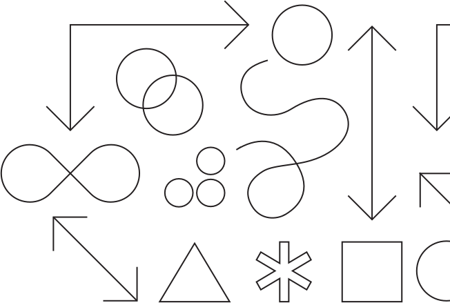

<title-block>
The key to solving 
business problems
is to focus on the
 human problems.
</title-block>

<grid background="gray-10">
<column lg="8">

Whether solving problems or serving clients, we put people at the center of everything we do. Design isn’t just a job; it’s a deep responsibility to the people we serve.

</column>

</grid>

<tile
    size="xl"
    background="black"
    light="true"
    title_one="Design Philosophy"
    title_two="The beliefs behind everything we do."
    description="Design is about moving people forward, both emotionally and functionally.">
    
  </tile>

  <tile
    size="xl"
    background="#E7E7E7"
    title_one="Design Thinking"
    title_two="Human-centered design at scale."
    description="Explore the framework that drives how we think and work every day.">
    
  </tile>

  <tile
    size="xl"
    background="#373737"
    light="true"
    title_one="Design Services"
    title_two="Your business partner by design."
    description="Partner with us to help define your strategy, create exceptional experiences, and drive better business outcomes.">
    
  </tile>
