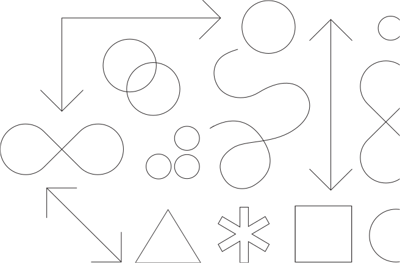

<title-block>

The key to solving 
business problems
is to focus on the
 human problems.

<anchor-links>

- [Design Philosophy](#design-philosophy)
- [Design Thinking](#design-thinking)
- [Design Services](#design-services)

</anchor-links>

</title-block>

<grid background="gray-10">
<column lg="8">

Whatever problem we're solving, we put
people at the center of everything we do.
Design isn’t just a job; it’s a deep
responsibility to the people we serve.

<icon name="ArrowDown32"></icon>

</column>

</grid>
<grid background="black" margin="false">
<column lg="4" offset_lg="1">

<h2><strong>Design Philosophy</strong> The beliefs behind everything we do.</h2>

Design is about giving people a path, both emotionally and functionally, towards their goals.

</column>
<column lg="8" offset_lg="3">

<tile
    href="/approach/design-philosophy"
    caption="caption"
    title="title">

</tile>

</column>
</grid>
<grid background="gray-20" margin="false">
<column lg="4" offset_lg="1">

<h2><strong>Design Thinking</strong> Human-centered design at scale.</h2>

Learn how you can apply the same framework our teams use every day.

</column>
<column lg="8" offset_lg="3">

<tile
    href="/approach/design-thinking"
    caption="caption"
    title="title">

</tile>

</column>
</grid>
<grid background="gray-80" margin="false">
<column lg="4" offset_lg="1">

<h2><strong>Design Services</strong> Your business partner by design.</h2>

Partner with us to help define your strategy, create exceptional experiences, and drive better business outcomes.

</column>
<column lg="8" offset_lg="3">

<tile
    href="/approach/design-services"
    caption="caption"
    title="title">

</tile>

</column>
</grid>
