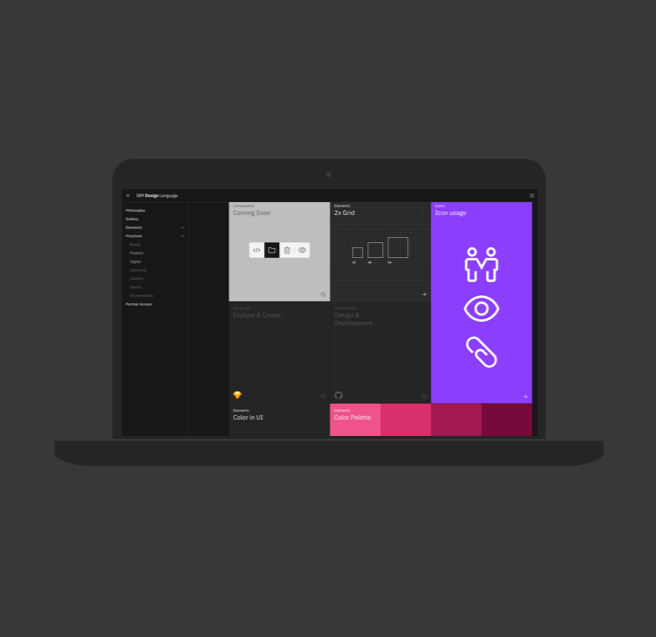

<grid background="gray-100">
<column lg="5">

## **Design philosophy**

IBMers believe in progress—that application of intelligence, reason and science can improve business, society and the human condition.

Given our scale and scope, ‘good design’ is not only a requirement, it’s a deeper responsibility to relationships we seek to serve.

</column>
<column lg="9" offset_lg="2">

<iframe src="https://player.vimeo.com/video/293453905?title=0&byline=0&portrait=0?color=ff0000" width="500" height="281" frameborder="0" webkitallowfullscreen mozallowfullscreen allowfullscreen />

</column>
</grid>
<grid background="gray-10">
<column lg="7" offset_lg="4">

<h2>Design is how  we <em>build</em> bonds.</h2>
Today, the talent, techniques, thinking and tools of design, like technology, have become more and more abundant and accessible to all alike.

</column>
<column lg="7" offset_lg="4">

Paradoxically, decisions are more distributed, and experiences can become less and less distinctive. The rapid, relentless pace to produce can create an uneven emphasis on immediacy and incrementalism over individuality and innovation.

It is more important than ever that we own our own ethos, make palpable our brand values, and incorporate an instantly identifiable IBMness in everything we do.

> _Without aesthetic, design is either the humdrum repetition of familiar clichés or a wild scramble for novelty. Without aesthetic, the computer is but a mindless speed machine, producing effects without substance, form without relevant content, or content without meaningful form.   – Paul Rand_

Aesthetic is defined as the philosophical theory or set of principles governing outward appearance or actions. This characteristic applied to any experience is essential to its effectiveness. Everything we do (and don’t do) communicates. The care and craft we put into every experience is equal to any confidence or consideration we should expect in return.

</column>

<column lg="3" offset_lg="2">

> **Good design is always good design**   What we borrow from our own design history is not a mid-century aesthetic in stylistic terms, but the modernist attitudes and approach used at the time.  Eliot Noyes taught us brand is character, and should be built through curation. Paul Rand taught us the importance of endless experimentation. Charles and Ray Eames brought out our playful nature, and were pioneering what is now referred to as “branded content” and “experiential.”  Their methods are as modern today as ever before, maybe more so.

</column>
</grid>
<grid background="gray-10">
<column lg="12" offset_lg="4">

<h2>Stand for =   Stand out</h2>

</column>
<column lg="7" offset_lg="4">

IBM has always served as a medium between mankind and machine, science, service and society, working in partnership on a path to progress.  This relationship is the basis of our brand and every experience with IBM. It is this dynamic we are designing when we design anything.  As IBMers, we believe the purpose of every design, and every designer, is to guide… to lead, to provoke, to provide, to progress, to move people emotionally and functionally forward, through big transformations or day-to-day tasks, here to there, to deliver peak professional performance and smarter business by design.

</column>
<column lg="3" offset_lg="2">

> Here → There Everything IBM and IBMers do is this. Everything we design should too.

</column>
</grid>
<grid background="gray-10">
<column lg="12" offset_lg="4">

## Think → Guide

</column>
<column lg="7" offset_lg="4">

Like our brand values, our design ethos must be palpable in everything we produce. Our philosophy and principles are for designers and non-designers alike, anyone authoring or authorizing any form of design on behalf of IBM. They provide clear criteria for the conception, creativity and craftsmanship our brand demands and our clients deserve. The expression of our philosophy may evolve and expand over time, but our principles are designed to endure, ensuring everything IBM is distinctly IBM.

</column>
<column lg="3" offset_lg="2">

> _A by-product of every experience with IBM should be time—time saved or time well-spent._  
> _– Jon Iwata_

</column>
</grid>

<tile
  size="md"
  background="#E7E7E7"
  title="See how we bring our philosophy to bear in our design systems."
  name="Design Thinking"
  href="">

</tile>

<grid background="gray-10">
<column lg="8">

<h3>Keep exploring our approach</h3>

</column>
<column lg="4">

 <strong>Design thinking</strong> 
Get familiar with how to apply the framework that drives how we think and work every day. 
<a href="/approach/design-thinking">Learn more</a>

</column>
<column lg="4">

 <strong>Design services</strong> 
Let’s define your strategy, create exceptional experiences, and drive better business outcomes. <a href="/approach/design-services">Learn more</a>

</column>
</grid>
