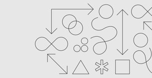

<grid background="gray-80" classname="background--header">
<column lg="4">

## **Design services**

Most companies make things for their clients. We prefer to co-create with you.

At IX, we blend design with innovative technologies and business strategy to offer you a comprehensive global business design partner.

</column>
<column lg="9" offset_lg="3">

<iframe title="video" src="https://player.vimeo.com/video/293453905?title=0&byline=0&portrait=0?color=ff0000" width="500" height="281" frameborder="0" webkitallowfullscreen mozallowfullscreen allowfullscreen />

</column>
</grid>
<grid background="gray-10">
<column lg="4">

### Capabilities

</column>
<column lg="8">

## By combining Design Thinking with practices like Agile and DevOps, we help clients design for the future while simultaneously evolving their existing businesses. Our work focuses on three foundational areas of client success.

</column>
<column lg="4" offset_lg="4" border="true">

### Creating future shaping experiences

Customers and employees are won and lost by the quality of your experience, not by the promises you make. By blending analytics, design and development, we help you create authentic interactions that drive meaningful business impact.

_Branding and communications  
Experience strategy & design  
Content strategy and production_

</column>
<column lg="4" border="true">

### Designing progressive digital strategies

Customers and employees are won and lost by the quality of your experience, not by the promises you make. By blending analytics, design and development, we help you create authentic interactions that drive meaningful business impact.

_Digital reinvention  
Business and talent transformation  
Responsive operating models_

</column>
<column lg="4" border="true">

### Putting customer platforms to work

Customers and employees are won and lost by the quality of your experience, not by the promises you make. By blending analytics, design and development, we help you create authentic interactions that drive meaningful business impact.

_Marketing operations  
Omni-channel commerce  
Customer relationship management_

</column>
</grid>

<grid background="gray-10">
<column lg="16">

<tile
    href="#"
    title="IBM iX"
    feature="true"
    feature_heading="Learn how you can partner with us to build better business."
    feature_background="black">

</tile>

</column>
<column lg="8">

<h3>Keep exploring our Approach</h3>

</column>
<column lg="4" md="4">

 <strong>Design Philosophy</strong> 
Our beliefs drive everything we do. Design is about moving people forward, both emotionally and functionally.  
<a href="/approach/design-thinking">Learn more</a> <icon color="blue" inline="true"></icon>

</column>
<column lg="4" md="4">

 <strong>Design Thinking</strong> 
Get familiar with how to apply the framework that drives how we think and work every day.   <a href="/approach/design-services">Learn more</a> <icon color="blue" inline="true"></icon>

</column>
</grid>
