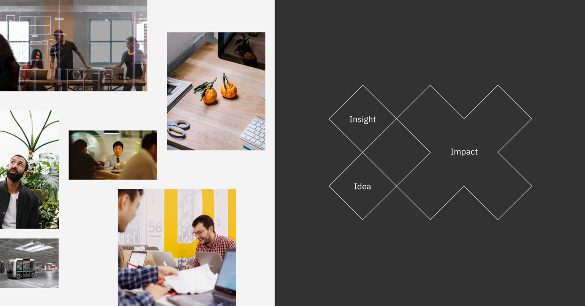
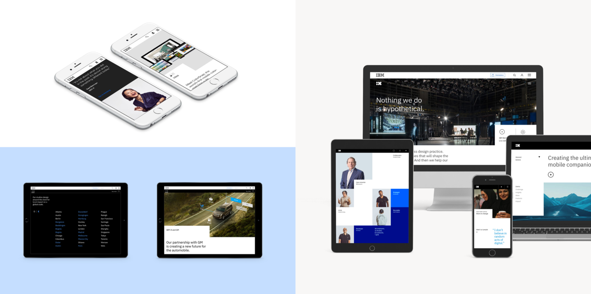

<grid background="gray-10">
<column lg="12" offset_lg="2">

## **Design services**

Most companies make things for their clients; we prefer to co-create with them.  At IX, we blend design with innovative technologies and business strategy to offer you a comprehensive global business design partner. By combining Design Thinking with practices like Agile and DevOps, we help clients design for the future while simultaneously evolving their existing businesses.

</column>
<column lg="12" offset_lg="2">

`vimeo: https://vimeo.com/293453905`

</column>
<column lg="7" offset_lg="2">

## Capabilities

Our work focuses on three foundational areas of client success.

</column>
<column lg="16">

</column>
<column lg="6" offset_lg="2">

### Creating future-shaping experiences

Customers and employees are won and lost by the quality of your experience, not by the promises you make. By blending analytics, design and development, we help you create authentic interactions that drive meaningful business impact.

</column>
<column lg="3" offset_lg="2">

> Branding and communications  Experience strategy & design  Content strategy and production

</column>
</grid>
<grid background="white">
<column lg="6" offset_lg="2">

### Designing progressive digital strategies

A business strategy that fails to account for the constantly changing needs and behaviors of its customers isn’t much of a strategy at all. We forge versatile, enduring strategies by reimagining how an organization innovates, operates, and engages with its environment, employees, customers, and partners.

</column>
<column lg="3" offset_lg="2">

> Digital reinvention Business and talent transformation Responsive operating models

</column>
<column lg="16">

</column>
<column lg="6" offset_lg="2">

### Putting customer platforms to work

In today’s world, people expect consistent, cohesive experiences at every touchpoint. Our insight-led strategy will help you do just that, providing a full range of “Consult to Operate’” services across stores, web, mobile and support channels to help you create a seamless end-to-end experience for your clients and customers.

</column>
<column lg="3" offset_lg="2">

> Marketing operations Omni-channel commerce Customer relationship management (CRM)

</column>
</grid>
<grid background="gray-10">
<column lg="14" offset_lg="2">

Visit the Plex website to dive into the details behind the design!.

<button text="Start using" href="#"></button>

</column>
</grid>

