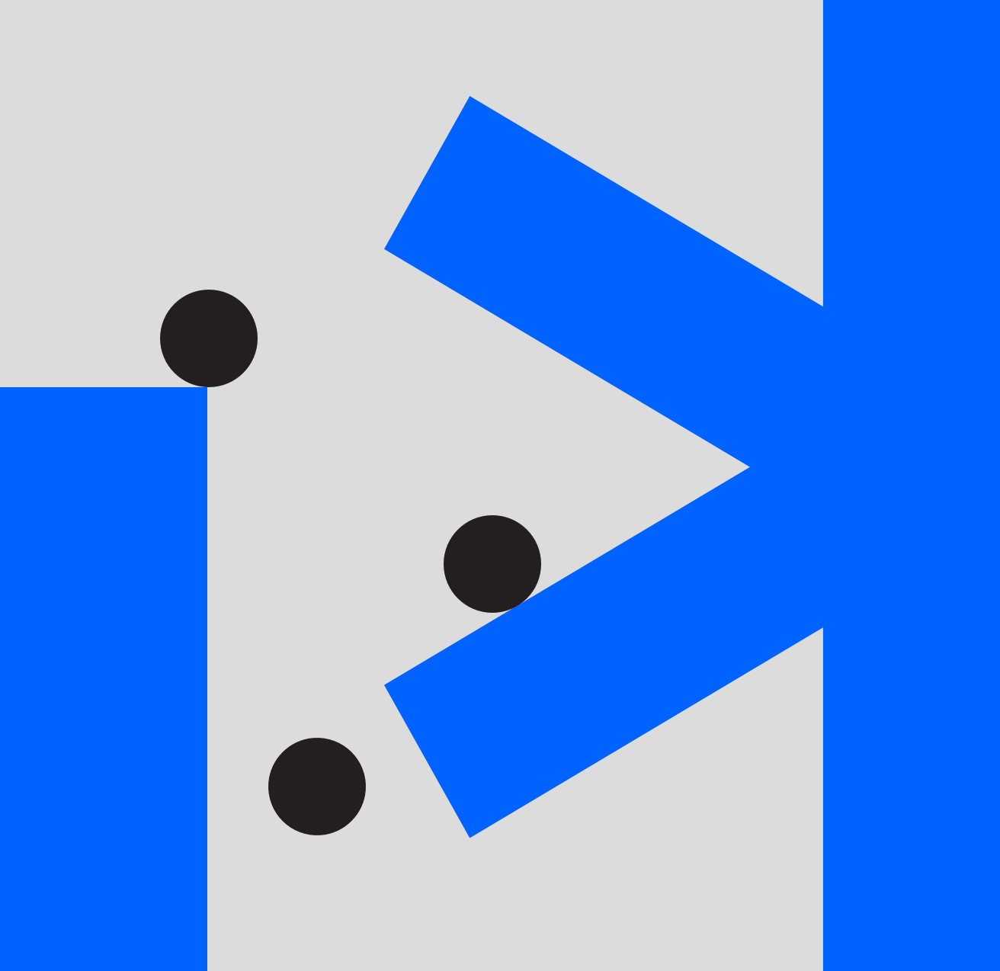
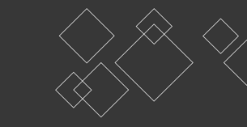
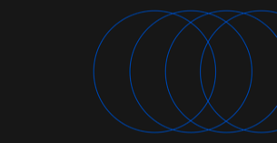

<grid background="gray-20">
<column lg="5">

## **Design thinking framework**

At its core, design thinking is the idea of putting human problems first.

We built on that idea, adding strategies, tactics and activities to create a framework uniquely tailored to address the challenges and scale of the modern enterprise.

</column>
<column lg="9" offset_lg="2">

`vimeo: https://vimeo.com/293453905`

</column>
</grid>
<grid background="gray-10">
<column lg="4">

### Principles

</column>
<column lg="12">

<h2>These are the foundational elements of our approach.</h2>

</column>
<column lg="4" offset_lg="4">

### Restless reinvention

_When’s the last time you rethought what you’re making?_   Everything is a prototype. Being essential – and staying essential –requires a continuous conversation with our users and clients, responding to their changing needs through rapid prototyping and constant iteration.

</column>
<column lg="4">

### A focus on user outcomes

_Who are you designing for?_   We measure success by how well we fulfill human needs. Our users are more than just the people we make for, they’re our partners in design.

</column>
<column lg="4">

### Diverse empowered teams

_Do you have the right mix of makers?_   Diversity is the bedrock of a dynamic team. By empowering people with different skillsets, backgrounds and perspectives to bring their unique points of view to the table, we generate more breakthrough ideas faster.

</column>
</grid>
<grid background="white">
<column lg="4">

### The Loop

</column>
<column lg="12">

<h2>A process of rapid iteration.</h2>

</column>
<column lg="4" offset_lg="4">

### Observe

To drive meaningful outcomes for our users, we must first gain a deep understanding of the challenges they face. By constantly immersing ourselves in the worlds of our users, we ensure that our z always address real-world needs.

</column>
<column lg="4">

### Reflect

Different people can interpret the same situation in very different ways. Coming together to Reflect on our observations helps us synthesize and analyze findings while also developing a more nuanced understanding of our users across the team.

</column>
<column lg="4">

### Make

The only way to see an outcome is to make one – even if the idea isn’t fully baked yet. Rapid, low-fidelity prototyping allows us to simulate ideas and test hypotheses quickly and cheaply. The end result: solutions that are robust, effective, and battle-tested.

</column>
</grid>
<grid background="gray-10">
<column lg="4">

### The keys

</column>
<column lg="12">

<h2>Tactics for maintaining alignment.</h2>

</column>
<column lg="4" offset_lg="4">

### Hills

Hills are concise statements of
the goals we aim to help our users accomplish. By making these goals explicit and keeping them top of mind, we align teams around a single shared mission.

</column>
<column lg="4">

### Playbacks

Playbacks are regular check-ins that bring users, stakeholders and teams together to tell stories and exchange feedback. They allow us to measure progress on a regular basis while uncovering and addressing any misalignment that may exist.

</column>
<column lg="4">

### Sponsor users

Sponsor users are real-world users that provide teams with deep expertise and knowledge on the problems they’re facing. They are crucial to keeping us aligned with our users reality throughout the course of a project.

</column>
</grid>

<tile
  size="md"
  background="#C5DEFF"
  title="Explore how you and your business can take advantage of our entire platform."
  name="Enterprise Design Thinking">

</tile>

<grid background="gray-10">
<column lg="8">

<h3>Keep exploring our approach</h3>

</column>
<column lg="4">

<strong> Design services</strong> 
Let’s define your strategy, create exceptional experiences, and drive better business outcomes. <a href="/approach/design-services">Learn more</a>

</column>
<column lg="4">

<strong> Design philosphy</strong> 
The beliefs behind everything we do. Design is about moving people forward, both emotionally and functionally. <a href="/approach/design-philosophy">Learn more</a>

</column>
</grid>
