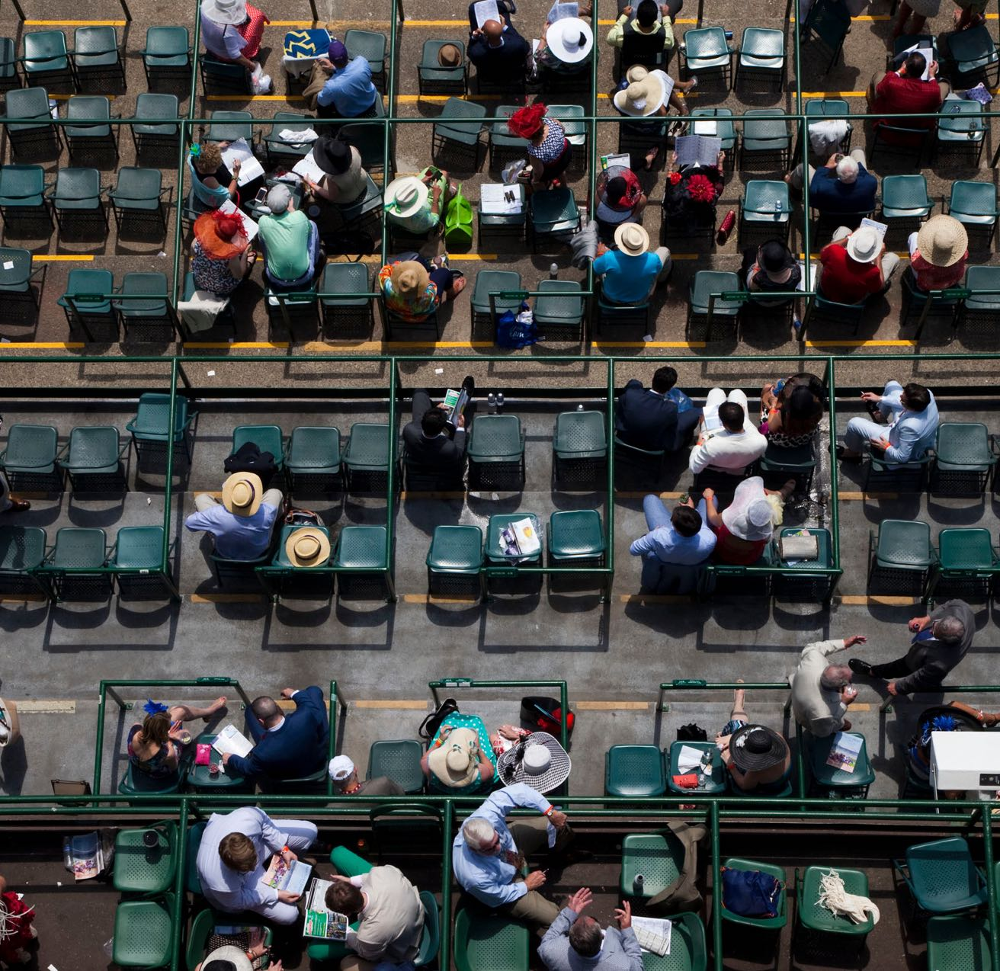

<grid background="magenta-20" classname="background--header background--thinking">
<column lg="4" md="4">

## **Enterprise Design Thinking**

Design thinking shouldn't be controversial—it's simply the idea that everyone on a team should be focused on their users, first and foremost.

We built on that idea, adding strategies, tactics and activities to create a framework that uniquely scales design thinking across teams of all shapes and sizes, whether they are co-located or widely dispersed.

</column>
<column lg="8" offset_lg="4" md="4">

</column>
</grid>
<grid background="gray-10">
<column lg="4">

### The Principles

</column>
<column lg="12"  md="5">

<h2>The foundational elements of our approach</h2>

</column>
<column lg="4" offset_lg="4" border="true"  md="5">

### A focus on user outcomes

_Who are you designing for, and what do they need?_   We measure success by how well we fulfill human needs. Our users are more than just the people we make for, they’re our partners in design.

</column>
<column lg="4" border="true"  md="5">

### Restless reinvention

_When’s the last time you rethought what you’re making?_   Everything is a prototype. Being essential—and staying essential—requires a continuous conversation with our users and clients, responding to their changing needs through rapid prototyping and constant iteration.

</column>
<column lg="4" border="true"  md="5">

### Diverse empowered teams

_Do you have the right mix of makers?_   Diversity is the bedrock of a dynamic team. By empowering people with different skillsets, backgrounds and perspectives to bring their unique points of view to the table, we generate more breakthrough ideas faster.

</column>
</grid>
<grid background="white">
<column lg="4">

### The Loop

</column>
<column lg="12" md="5">

<h2>A process of rapid iteration</h2>

</column>
<column lg="4" offset_lg="4" border="true" md="5">

### Observe

To drive meaningful outcomes for our users, we must first gain a deep understanding of the challenges they face.
  
By constantly immersing ourselves in the worlds of our users, we ensure that our solutions always address real-world needs.

</column>
<column lg="4" border="true" md="5">

### Reflect

Different people can interpret the same situation in very different ways.
  
Coming together to reflect on our observations helps us synthesize and analyze findings, building a more nuanced understanding of our users across the team.

</column>
<column lg="4" border="true" md="5">

### Make

The only way to see an outcome is to make one—even if the idea isn’t fully baked yet.
  
Rapid, low-fidelity prototyping allows us to simulate ideas and test hypotheses quickly and cheaply. The end result: solutions that are robust, effective, and battle-tested.

</column>
</grid>
<grid background="gray-10">
<column lg="4">

### The Keys

</column>
<column lg="12">

<h2>Tactics for maintaining alignment</h2>

</column>
<column lg="4" offset_lg="4" border="true" md="5">

### Hills

Hills are concise statements of
the goals we aim to help our users accomplish. By making these goals explicit and evaluating them regularly, we align teams around a single shared mission.

</column>
<column lg="4" border="true" md="5">

### Playbacks

Playbacks are regular check-ins that bring users, stakeholders and teams together to tell stories and exchange feedback. They allow us to measure progress on a regular basis while uncovering and addressing any misalignment that may exist.

</column>
<column lg="4" border="true" md="5">

### Sponsor Users

Sponsor users are real-world users that provide teams with deep expertise and knowledge on the problems they’re facing. They are crucial to keeping us aligned with our users' reality throughout the course of a project.

</column>
</grid>
<grid background="gray-10">
<column lg="16">

<tile
    href="https://www.ibm.com/design/thinking/"
    title="Enterprise Design Thinking"
    feature="true"
    feature_heading="Explore our framework and start driving better, human-centered outcomes at any scale."
    feature_background="black">

</tile>

</column>
<column lg="8">

<h3>Keep exploring our approach</h3>

</column>
<column lg="4" md="4">

##### Design services

Let’s define your strategy, create exceptional experiences, and drive better business outcomes.

<a href="/design/approach/design-services">Learn more →</a>

</column>
<column lg="4" md="4">

##### Design philosphy

Our beliefs drive everything we do. Design is about moving people forward, both emotionally and functionally.

<a href="/design/approach/design-philosophy">Learn more →</a>

</column>
</grid>
