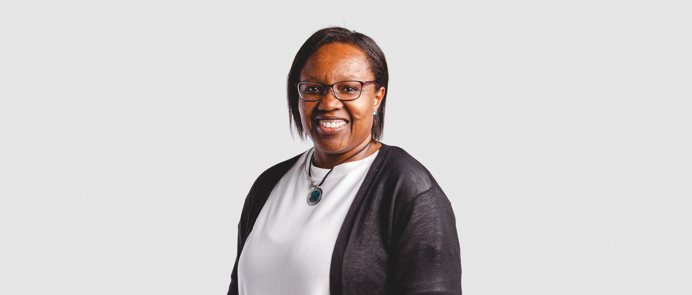

<grid classname="background-bleed">
<column lg="16">

<art-direction>

</art-direction>

</column>
</grid>

<grid background="gray-10">
<column md="2" lg="4">

#### Dawn Ahukanna

#### Introduce yourself.

</column>

<column md="5" lg="8">

I define myself as a Computational Designer, as defined by John Maeda: Computational Designers are creative people who wield their mastery of knowing how software, hardware, and the network all interact.

I’ve always been curious about how “things” work and what could be possible by taking things apart and trying, failing, learning—trying, failing, learning numerous times and finally reassembling. Sometimes that means making completely new things, in what should have been a reassembly process.

I started my career taking things apart at the atomic level and figuring out how they worked, as a Chemical Engineer. Then, simulating and emulating abstract models with software programming, as a software Architect and Developer. Finally, progressing to figuring out how people work, without taking them apart or simulating, as a Design Principal and Front-End Architect.

</column>
</grid>

<grid background="gray-10">
<column md="2" lg="4">

#### What are the advantages of working with diverse teams?

</column>

<column md="5" lg="8">

You are continually exposed to different skills, perspectives, thinking styles, and cultures that people bring from their lived experiences. This all contributes to really considering all these variables embodied in actual people, before you even get to talking to target users. That really builds the team empathy muscle, which we need as a company to build products our clients will choose to use, not just forced on them by their corporate policy. Plus, it really creates a collaborative, creative, and inspiring environment to work in, too.

</column>
</grid>

<grid background="gray-10">
<column md="2" lg="4">

#### What are you doing to make IBM a better place to work for women in design?

</column>

<column md="5" lg="8">

By applying three principles on a daily basis. One, being deliberate about choosing to mentor and sponsor women designers/developers together, as I believe these skills are two different perspectives on the same central thing: designing digital experiences that address a real user’s need. By getting designers and developers to see their pairing partnership and collaboration as a natural, mutually beneficial symbiosis, plus providing space for them to connect, practice, and grow, collaboration becomes the default operative mode.

  

Two, create an environment that supports people to ask for help, ask for what they want to progress their careers, and share those seemingly crazy and impossible ideas. Make safe spaces to share and discuss challenges, as well as work through different approaches to figure out what works for the individual designer’s career and their current circumstances and situation.

Three, collaborating across disciplines: When the IoT Munich Center education program for developers kicked off, my team members of developers, designers, and IoT engineers suggested adding the designer skill set. We asked, and we have had a number of designers participate.
 

We also had someone ask if we could have a design intern on the team, who would be working alongside developers using design thinking and Agile. Now we have a design intern who’s a woman working with the Munich Center team on her undergraduate project.

</column>
</grid>

<grid background="gray-10">
<column md="2" lg="4">

#### Do you think IBM is a unique place to work as a woman in design?

</column>

<column md="5" lg="8">

It’s a unique place to be a designer! This 100-year-old tech behemoth is committed to imbuing everyone with the culture of being human-centered by practicing Enterprise Design Thinking. And this is at every level of the company (CEO, executives, managers, and across all business functions), which is amazing, incredible, and puts a skip in my step every day I come into work.

The challenge for women in design is not to allow themselves, or anyone else for that matter, to be pigeon-holed and restricted into some narrow, limited definition of what it means to be a practicing designer. Women are eternally navigating the societal default, assumed assignment of fulfilling the nurturer, Mother Earth role.

The opportunities for a designer in IBM are immense. We are needed at this unique time in history for designers. We’re taking on projects that are unique, will have a major impact, and include challenging design problems to address. With my amazing and talented colleagues, it’s inspiring to have the opportunity to co-create the next generation of artificial intelligence and quantum technology user experiences, affecting the daily business and lives of billions of people on this planet.

</column>
</grid>

<grid background="gray-10">
<column md="2" lg="4">

#### How would your career have been different if you were a man?

</column>

<column md="5" lg="8">

I would not have to spend energy and time continually addressing and disproving the assumptions of clients and colleagues who don’t believe I am technically proficient or have a depth of knowledge, skills, and experience to do the job I was hired and being paid to do.
 

This is a huge hidden, unseen psychological and mental burden that has an immense negative impact on the ability of anyone to be creative and innovative.

It would be wonderful to start working on a project from a starting position of acceptance and expectation that you are capable of delivering what is asked.

</column>
</grid>

<grid background="gray-10">
<column md="2" lg="4">

#### Any last thoughts?

</column>

<column md="5" lg="8">

Really listen to and be curious about your team members’ and stakeholders’ skills, experiences, and needs. Don’t assume what you know represents their lived existence, especially if what they do is not your domain of expertise.

Be curious and challenge yourself to make sure that your design team is internally and externally diverging, not being premature in converging.

</column>
</grid>
