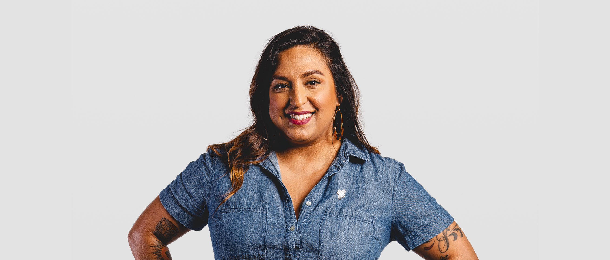

<grid classname="background-bleed">
<column lg="16">

<art-direction>

</art-direction>

<community-lead name="Haidy Perez-Francis" position="Design Executive" department="IBM Security"></community-lead>

</column>
</grid>

<grid className="community__grid" background="gray-10">
<column sm="3" md="3" lg="3">

Introduce yourself.

</column>

<column md="6" lg="8" offset_lg="1">

I’m a proud Latina, 1st generation American leading Design for IBM Security. My focus is on enterprise product and brand design with a globally distributed, multidisciplinary team of designers, researchers, and developers focused on reducing Security’s complexity by delivering simple, modern, and compose-able solutions to our customers. I’m a mother and wife married to an incredible ally, and I love reality TV.

</column>
</grid>

<grid className="community__grid" background="gray-10">
<column sm="3" md="3" lg="3">

What was your path into the design profession?

</column>

<column md="6" lg="8" offset_lg="1">

I originally started my journey as a pre-med student when I had a life-changing event that made me reevaluate my career goals. I knew I always had a love for typography, art, fashion, and color theory. I always admired people that were skilled in drawing and painting—I’m not that person. I didn’t think I could pursue a career as an artist because I couldn’t draw a circle to save my life, and I had my heart and soul set on being a doctor since I can remember.

Making a transition into a creative field was not something I thought I could do and make a respectable living. It was not an option that was made available to me as a young adult either. I was introduced to the field of graphic design from my brother, who was pursuing a career in multi-media. I decided to do some research and took a gamble and go to school, thinking I would have a degree where I could go into publishing and be a print designer. I did do that for several years after graduation and worked for several publishing houses.

</column>
</grid>

<grid className="community__grid" background="gray-10">
<column sm="3" md="3" lg="3">

What are you doing to make IBM a better place to work for women in design?

</column>

<column md="6" lg="8" offset_lg="1">

We need to hire more women in technical careers. I empower them to tackle hard problems and create a culture of inclusivity by providing the right opportunities at the right time, even if they don’t think they are “ready.” What I’ve learned is most women will self-select out of jobs or roles because they don’t feel like they are 100% qualified. I help women understand how being 100% qualified isn’t always the answer—it’s about being 100% confident in their abilities to learn and grow and pursue their personal best, the rest will follow. Designers have superpowers, and sometimes it’s hard to see that when you are the minority in the conversation dominated by engineers. Fostering their skills and helping women sharpen their pencils to leverage their superpower and join the conversation as an equal, respected team member is essential to our culture.

</column>
</grid>

<grid className="community__grid" background="gray-10">
<column sm="3" md="3" lg="3">

Do you think IBM is a unique place to work as a woman in design?

</column>

<column md="6" lg="8" offset_lg="1">

For me, IBM allows me to show up as my authentic self. Being a woman of color, it’s essential to find a culture and leadership that respects you for the real person that you are and what you can bring to the table. I’ve been fortunate to have had great leaders at IBM, both men and women, that have opened doors and provided me with the right opportunities to excel in my craft and career. I never in my wildest dreams could I imagine a Latina from Queens, New York could be an executive at a company like IBM for design. I’m in a highly technical space, using my superpower to change the culture and deliver business results with a graphic design background. I see women leading and inspiring me to do my best work. Do I think we still have more work to do to excel women in leadership positions? Yes! But I also feel like we have some of the smartest women doing some fantastic work and being given an equal opportunity to excel.

</column>
</grid>

<grid className="community__grid" background="gray-10">
<column sm="3" md="3" lg="3">

How would your career have been different if you were a man?

</column>

<column md="6" lg="8" offset_lg="1">

Less pressure to perform and stand out. Less expectation for me to be “nice” and amicable. Taken more seriously. Not having to overemphasize and work extra hard to prove worth.

</column>
</grid>

<grid className="community__grid" background="gray-10">
<column sm="3" md="3" lg="3">

Any last thoughts?

</column>

<column md="6" lg="8" offset_lg="1">

Be bold. Be confident. Keep working your plan. #notsorry

</column>
</grid>
