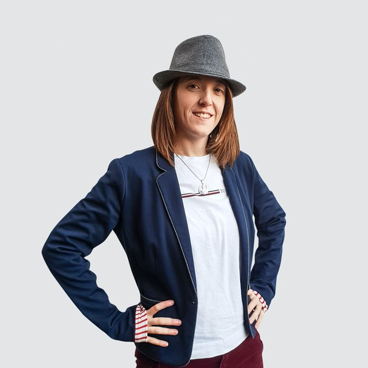
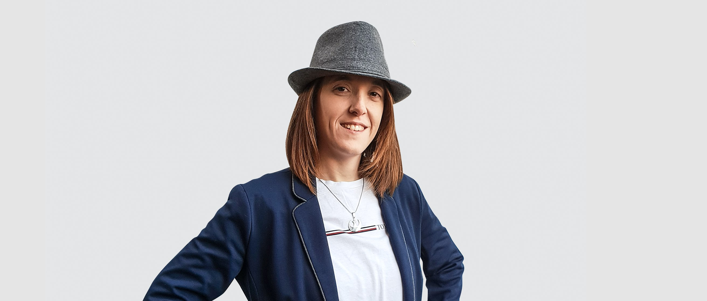

<grid classname="background-bleed">
<column lg="16">

<art-direction>

</art-direction>

<community-lead name="Maria Rose Espadaler Mazo" position="Customer Engagement and Design Practice Leader" department="IBM Services"></community-lead>

</column>
</grid>

<grid className="community__grid" background="gray-10">
<column sm="3" md="3" lg="3">

Introduce yourself.

</column>

<column md="6" lg="8" offset_lg="1">

I’m a 36-year-old self-made problem solver with infinite curiosity that drives me to keep learning how things work, what makes people tick. 

When I was little, I dismantled toys to understand their mechanics, I preferred the freedom Lego blocks gave me to create, and I read classic books to discover new worlds and the emotional and psychological intricacies of humans.

Now I use the creativity, analysis, and empathy I cultivated to deliver beyond expectations, spreading team spirit and collective intelligence.

</column>
</grid>

<grid className="community__grid" background="gray-10">
<column sm="3" md="3" lg="3">

What was your path into the design profession?

</column>

<column md="6" lg="8" offset_lg="1">

With a 5-year BSc in Digital Design and a MSc in Animation from Barcelona universities, I started my career as a Web Designer 16 years ago, working for the banking, manufacturing, and hospitality sectors. Over the years, I broadened my horizons, illustrating children books for a Canadian publishing company and freelancing as a Storyboard Artist for the Peter Drucker Institute. I also designed iOS apps for pharmacy companies and accessible, encrypted, web-responsive voting solutions for European and Middle Eastern countries.

Since joining IBM, I have further developed my design, development and consultancy expertise to help accelerate business growth in DS&iX SPGI and raise the bar in the delivered human experience for our clients.

So, even though I started my career as an artist and evolved into a UX/UI Designer along the years, nowadays I wouldn’t call myself a designer but a humanist. I try to diversify my knowledge and avoid tags that would limit my potential, knowing that there’s still so much I don’t know, and I could learn.

</grid>

<grid className="community__grid" background="gray-10">
<column sm="3" md="3" lg="3">

Which career stage is the hardest for women?

</column>

<column md="6" lg="8" offset_lg="1">

From my experience, the higher the level, the harder to be viewed as an equal. On the other hand, designers are only viewed as “doers,” “order-followers”. 

So, any woman in design who wants to progress in her career will have to demonstrate more knowledge than an older man and more flexibility cross-discipline than an engineer.

</column>
</grid>

<grid className="community__grid" background="gray-10">
<column sm="3" md="3" lg="3">

How can we shape a better future for more diversity in design at IBM?

</column>

<column md="6" lg="8" offset_lg="1">

Reality is multifaceted. Complex problems are not one-dimensional. The same happens with people. People are an amalgamation of skills and knowledge that have the potential to go further than what social preconceptions establish depending on their age, discipline, or background.

If we give voice to people from different ages, we will be able to leverage the boldness of trying new things with the wisdom from years of experience.

If we listen to people from different disciplines and backgrounds, we will be able to get a wider and more accurate perspective of any situation.

In short, we can shape a better future for IBM as a whole if we avoid elitism and learn to appreciate the enrichment diversity provides to decision-making.

</column>
</grid>

<grid className="community__grid" background="gray-10">
<column sm="3" md="3" lg="3">

How would your career have been different if you were a man?

</column>

<column md="6" lg="8" offset_lg="1">

It would certainly have been easier to make my voice heard in any of the companies I have worked for. And I would have not need to justify my decisions or demonstrate my knowledge so often.

</column>
</grid>

<grid className="community__grid" background="gray-10">
<column sm="3" md="3" lg="3">

Any last thoughts?

</column>

<column md="6" lg="8" offset_lg="1">

Give us the opportunity to compete on an equal footing with men to progress our career without belittling us or excluding us from certain decision areas.

Give us the opportunity to demonstrate that our contribution is not an emotional nuisance but an enrichment to provide solutions than can cater to a wider audience.

Open your mind to a different perspective than yours; shut your eyes and listen with your logical and emotional senses. You might get surprised and “see” we are not that different after all.

</column>
</grid>
