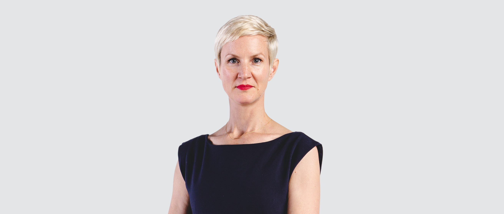

<grid classname="background-bleed">
<column lg="16">

<art-direction>

</art-direction>

<community-lead name="Sabine Roehl" position="Distinguished Designer and Chief Creative Officer" department="iX North America"></community-lead>

</column>
</grid>

<grid className="community__grid" background="gray-10">
<column sm="3" md="3" lg="3">

Introduce yourself.

</column>

<column md="6" lg="8" offset_lg="1">

My name is Sabine Roehl, and I’m an IBM Distinguished Designer and the Chief Creative Officer for [IBM iX]( https://www.ibm.com/services/ibmix/) North America. My mission as a Distinguished Designer is to bring together the iX studios across North America with a shared creative vision and creative quality standards to ensure delivery excellence across all practices for IBM iX NA. My passion is advocating for equal representation in design that mirrors the world.

</column>
</grid>

<grid className="community__grid" background="gray-10">
<column sm="3" md="3" lg="3">

What is your greatest career achievement?

</column>

<column md="6" lg="8" offset_lg="1">

At the risk of sounding like a cliché, my greatest career achievement is my current role. Being responsible for shaping and conveying the larger vision for delivery and design excellence with an organization like IBM iX is something I’ve wanted to do my entire career. Enabling people to do their best work while focusing on our clients’ needs creates an exciting balance of two forces that don’t necessarily work together in design all the time.

The reason I was able to get to this point is a combination of two key things: sponsorship and tenacity. Sponsorship from leaders that believed in me and put new challenges in front of me. And the tenacity and grit to not give up when things got bumpy. Thanks to those two critical elements, I stuck with it and put my time in earlier in my career as a designer, then as a manager, now as a leader. 

</column>
</grid>

<grid className="community__grid" background="gray-10">
<column sm="3" md="3" lg="3">

Which career stage is the hardest for women?

</column>

<column md="6" lg="8" offset_lg="1">

New mothers can have a challenging time at work. A supportive partner is certainly key, but a supportive workplace is also crucial. Arrangements like working part-time or working from home a few days each week can be a game changer while the kids are young. Coming back to work after giving birth is a very vulnerable time in one’s career, especially as a growing leader or a less established manager. 

I personally chose to wait until I achieved a significant career goal I had set for myself before starting to have children. I’d add, however, that it gets better. Co-workers understand that while the demands on your time outside of work have changed, you as a designer, a thinker, and contributor have not changed. Your craft is still your craft. Your passion and skill are still the same and so is your dedication to bring your best every day.

</column>
</grid>

<grid className="community__grid" background="gray-10">
<column sm="3" md="3" lg="3">

What are you doing to make IBM a better place to work for women in design?

</column>

<column md="6" lg="8" offset_lg="1">

I started the initiative WOMEN I DESIGN I IBM, which is why you are reading these interviews like this one, celebrating all these amazing designers and design leaders in honor of International Women’s Day 2020. 

I am in so in awe of the tremendous talent we have at IBM, and while we have a good balance of women in design here overall, we are not seeing equal representation in leadership. Putting a spotlight on this talent and how relevant their thinking is for the organization felt like an organic way to start the conversation that many of us want to have.

Showing future generations of women designers a track to leadership and career growth will start us on the right path to an equitable future. 

I feel strongly that we need a representative workforce to tackle the challenging problems we are working on. Diversity of thought and opinion and perspectives from all walks of life is the only way to get to good design that is good business and real human-centered outcomes.

Earlier in my career I looked up to strong women design leaders—the few that I could find— and I hope to be a role model for generations to come.

</column>
</grid>

<grid className="community__grid" background="gray-10">
<column sm="3" md="3" lg="3">

How would your career have been different if you were a man?

</column>

<column md="6" lg="8" offset_lg="1">

If I were a man, I would have been offered more opportunities at an earlier time in my career. I have worked at organizations that were less conducive for women advancement, where women were not top-of-mind for leadership positions. As many young designers do, I thought this was due to my lack of experience, but this was symptomatic for many women creatives I’ve seen.

On a positive note, if I were a man, I would lack the rich and dimensional perspective I have earned by having made my career in a male-dominated profession, as a mother of two. This, in turn, allows me to help other creatives find their path to advance and step into the shoes of a role model.

</column>
</grid>

<grid className="community__grid" background="gray-10">
<column sm="3" md="3" lg="3">

Any last thoughts?

</column>

<column md="6" lg="8" offset_lg="1">

In 2020, as designers, we should move beyond awareness and become all about action. Coming up with the idea to showcase women designers at IBM is one of the actions I have taken to personally drive diversity in my particular field of work. 

With this in mind, the call to action from me would be “do something.” Form a group, give a woman colleague a shout-out, be outspoken if you are feeling under-represented or see coworkers being treated unfairly. It’ll take all of us— men and women— to get to a level of diversity that represents everybody fairly.

Together, as we face new challenges and find new solutions, as we pay attention to those details, commit to doing one thing you haven’t done before, or even learn something new. It’ll pay off for all of us in the long run.

</column>
</grid>
