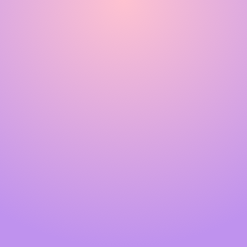

<grid background="gray-10">
<column lg="4">

## Small tile w/ image

<tile
    caption="optional caption"
    name="name"
    href="#">
    
  </tile>

</column>
<column lg="4">

## Small tile w/ out an image

<tile
    caption="optional caption"
    name="name"
    href="#">
  </tile>

</column>
</grid>
<grid background="white">
<column lg="16">

## Md Tile

</column>
</grid>

<tile
    size="md"
    background="black"
    light="true"
    title="optional title"
    name="name"
    caption="optional caption"
    title_secondary="title_secondary"
    description="description"
    icon="ArrowRight16"
    href="/approach/design-philosophy">
    
  </tile>

<grid background="gray-10">
<column lg="12" offset_lg="4">

## Large Tile

<tile
    size="lg"
    background="#C5DEFF"
    light="true"
    caption="caption"
    name="name">
    
  </tile>

</column>
</grid>

## XL Tile

<tile
    size="xl"
    background="black"
    light="true"
    title="title"
    title_secondary="title_secondary"
    description="description"
    icon="ArrowRight16"
    href="/approach/design-philosophy">
    
  </tile>
  