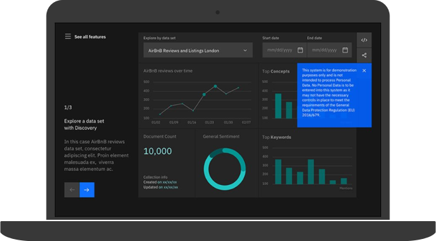
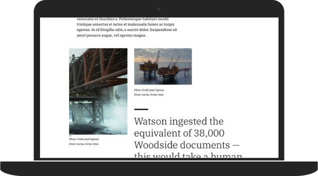
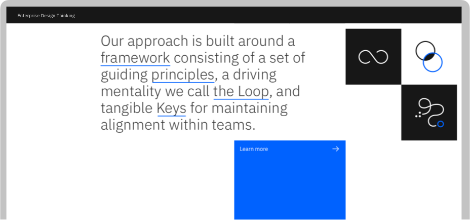
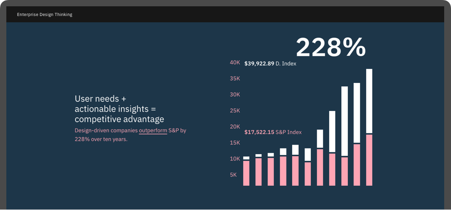

<title-block>

<anchor-links>

- [IBM design language](#how-we-work)
- [Enterprise design thinking](#dimensions-of-diversity)
- [IBM design research](#work-with-us)

</anchor-links>

Spend less time 
building buttons 
and more time 
building bonds.

</title-block>

<grid background="gray-10">
<column lg="8">

Tap into a growing collection of design tools, assets and resources to keep your business moving forward.

</column>
<column lg="16">

<tile
    size="xlarge"
    background="#171717"
    light="true"
    no_gutter="true"
    title_one="IBM Design Language"
    title_two="Principles, guidelines and ready-made assets to help you build exceptional experiences.">
    
  </tile>

</column>
<column lg="16">

  <tile
    size="large"
    background="#252525"
    light="true"
    no_gutter="true"
    title_one="Product"
    title_two="Design System"
    description="This collection of UI components, guidelines, code, and tooling ensures IBM products share a unified user experience.">
    
  </tile>

</column>
<column lg="16">

  <tile
    size="large"
    background="#383838"
    light="true"
    title_one="Digital"
    title_two="Design System"
    description="This collection of elements, components, guidelines, code, and tooling is used to create unified user journeys.">
    
  </tile>

</column>
<column lg="16">

<tile
    size="xlarge"
    background="white"
    title_one="Enterprise Design Thinking"
    title_two="A scalable learning approach that makes design thinking stick. ">
    
  </tile>

</column>
<column lg="16">

  <tile
    size="xlarge"
    background="#FFD2DD"
    title_one="IBM Design Research"
    title_two="Drive actionable user insights through observation, experience, and making.">
    
  </tile>

</column>

</grid>
