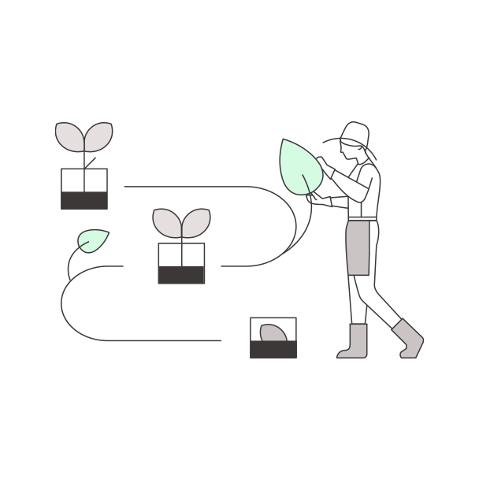
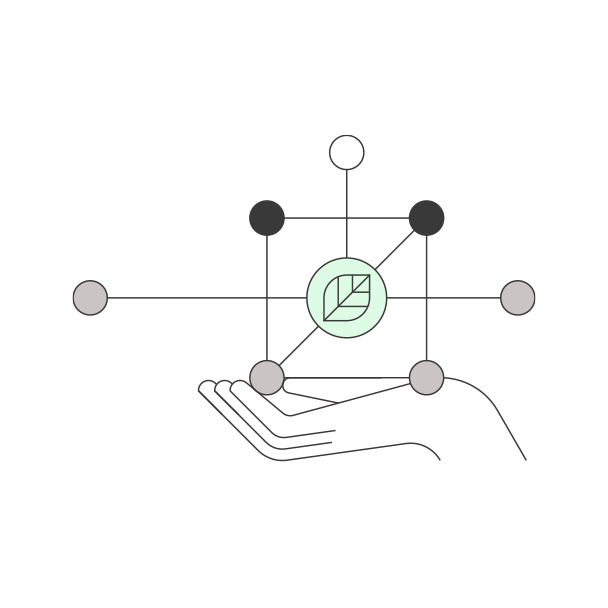
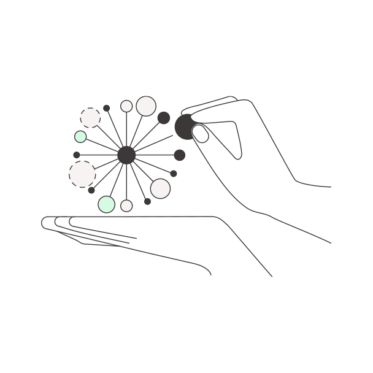

<back-link to="/impact">Impact Stories</back-link>

<grid classname="background-bleed">
<column lg="16">

</column>

</grid>

<grid background="gray-10">
<column md="2" lg="4">

### Design for Sustainability

</column>

<column md="5" lg="8">

IBM designers are committed to making progress to improve the human condition, society, and the environment.

As designers we define sustainability as bringing prosperity to all people, communities, and the planet. Sustainability includes reducing our impact on limited resources. To achieve this vision of <a href="https://www.un.org/en/academic-impact/sustainability" target="_blank">sustainability</a>, we practice <strong>IBM Design for sustainability</strong> and use it as a framework for how we satisfy the needs of the present without compromising the future. This is how we ensure that IBM’s designers and their teams create more sustainable value.

Design for sustainability requires a <a href="https://www.ibm.com/design/thinking/page/framework/principles/diverse-empowered-teams" target="_blank">diverse and empowered team</a>. As a team, we make sure that the user, community, and social value of the experience outweighs any negative environmental and social impact. Understanding these impacts and their effect on the delivered experience is especially critical when AI is included. An efficient and inclusive front end has only so much impact on sustainability unless equal attention is given to the development and operations of the experience.

<icon name="PlexArrowDown"></icon>

</column>
<column lg="3" offset_lg="1" md="3" sm="0">

> **"Good design is good business. Good design is also more sustainable."**
  **Chris Hammond**
 Design Principal
 IBM Sustainability Software

</column>
</grid>

<grid background="white">
<column lg="4">

### The Principles

Enabled by diverse empowered teams.

</column>
<column lg="12"  md="5">

<h2>Our guiding principles are:</h2>

</column>
<column lg="4" offset_lg="4" border="true"  md="5">

### Inclusive for all living things.
 
 
 
 
 

</column>
<column lg="4" border="true"  md="5">

### Easy to learn and to use for all people.
 
 
 
 
 

</column>
<column lg="4" border="true"  md="5">

### Efficient for users and power consumption.
 
 
 
 
 

</column>
</grid>

<grid background="gray-10">
<column lg="16">

</column>
<column lg="4">

### Additional resources

</column>

<column lg="4" md="4">

<tile
    href="#"
    title="Download the paper & heuristic">
    
</tile>

</column>
<column lg="4" md="4">

<tile
    href="#"
    title="Learn more about IBM’s Environmental, Equitable, and Ethical Impact">
    
</tile>

</column>
<column lg="4" md="4">

<tile
    href="#"
    title="Learn more about IBM’s Sustainability Solutions & Products">
    
</tile>

</column>
</grid>

