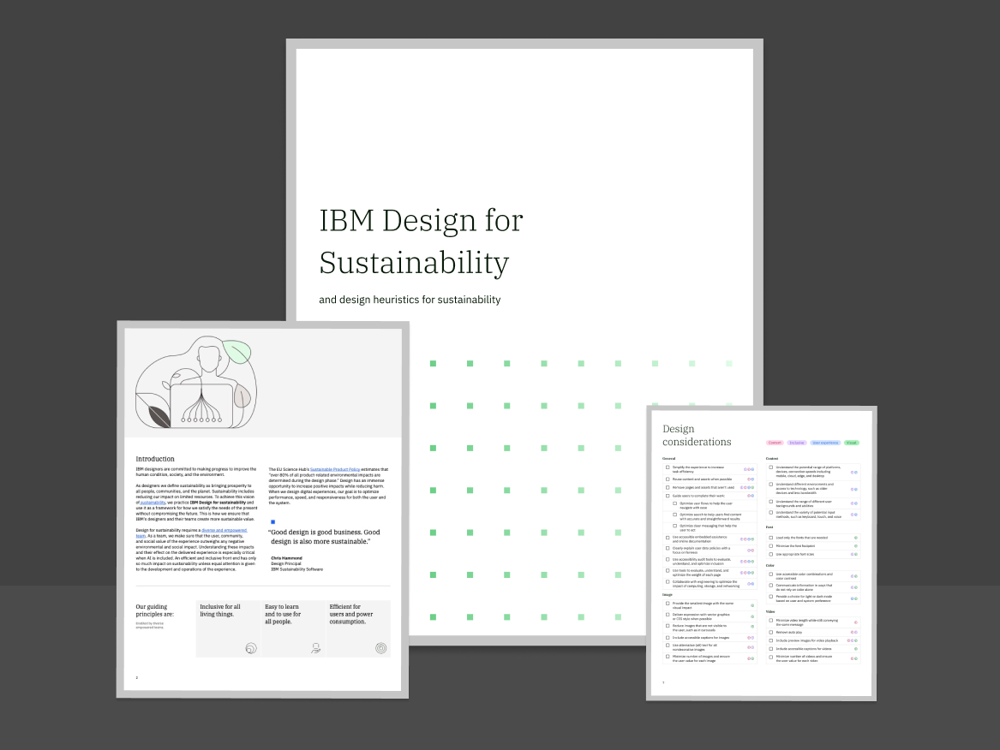

<back-link to="/impact">Impact Stories</back-link>

<grid classname="background-bleed">
<column lg="16">

</column>

</grid>

<grid background="white">
<column md="2" lg="4">

### IBM Design for Sustainability

</column>

<column md="5" lg="8">

IBM designers are committed to making progress to improve the human condition, society, and the environment.

As designers we define sustainability as bringing prosperity to all people, communities, and the planet. Sustainability includes reducing our impact on limited resources. To achieve this vision of <a href="https://www.un.org/en/academic-impact/sustainability" target="_blank">sustainability</a>, we practice <strong>IBM Design for sustainability</strong> and use it as a framework for how we satisfy the needs of the present without compromising the future. This is how we ensure that IBM’s designers and their teams create more sustainable value.

Design for sustainability requires a <a href="https://www.ibm.com/design/thinking/page/framework/principles/diverse-empowered-teams" target="_blank">diverse and empowered team</a>. As a team, we make sure that the user, community, and social value of the experience outweighs any negative environmental and social impact. Understanding these impacts and their effect on the delivered experience is especially critical when AI is included. An efficient and inclusive front end has only so much impact on sustainability unless equal attention is given to the development and operations of the experience.

<icon name="PlexArrowDown"></icon>

</column>
<column lg="3" offset_lg="1" md="2" sm="0">

> _"Good design is good business. Good design is also more sustainable."_

> **Chris Hammon**
 
Design Principal 
 
IBM Sustainability Software

</column>
</grid>

<grid background="gray-10">
<column lg="4">

### The Principles

Enabled by diverse empowered teams.

</column>
<column lg="12"  md="5">

<h2>Our guiding principles are:</h2>

</column>
<column lg="4" offset_lg="4" border="true"  md="5">

### **Inclusive for all   living things.**

_Placeholder for a question?_   DiLorem ipsum dolor sit amet, consectetur adipiscing elit, sed do eiusmod tempor incididunt ut labore et dolore magna aliqua. Ut enim ad minim veniam, quis nostrud exercitation ullamco.

</column>

<column lg="4" border="true"  md="5">

### **Easy to learn and to use   for all people.**

_Placeholder for a question?_   DiLorem ipsum dolor sit amet, consectetur adipiscing elit, sed do eiusmod tempor incididunt ut labore et dolore magna aliqua. Ut enim ad minim veniam, quis nostrud exercitation ullamco.

</column>

<column lg="4" border="true"  md="5">

### **Efficient for users and   power consumption.**

_Placeholder for a question?_   DiLorem ipsum dolor sit amet, consectetur adipiscing elit, sed do eiusmod tempor incididunt ut labore et dolore magna aliqua. Ut enim ad minim veniam, quis nostrud exercitation ullamco.

</column>

</grid>

<grid background="gray-10">
<column lg="16">

<tile
    href="#"
    dark="true"
    icon="Download"
    title="Download"
    feature="true"
    feature_background="black"
    feature_heading="IBM Design for sustainability position paper">

</tile>
</column>

</column>
<column lg="8">

<h3>Keep learning about our  stance on sustainability</h3>

</column>

<column lg="4" md="4">

##### Influence

IBM’s Environmental, Equitable,  and Ethical

<a href="#">Learn more →</a>

</column>
<column lg="4" md="4">

##### Solutions

IBM’s Sustainability Solutions  & Products

<a href="#">Learn more →</a>

</column>
</grid>
