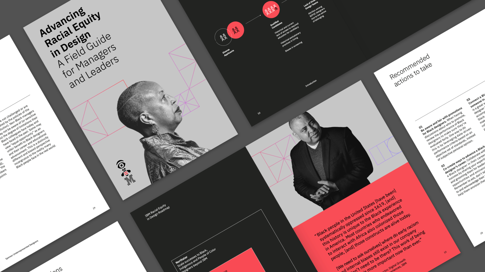
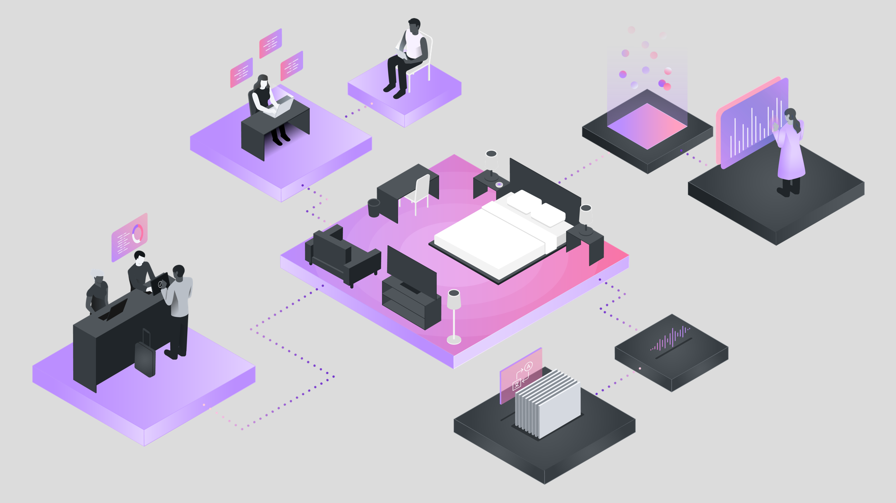
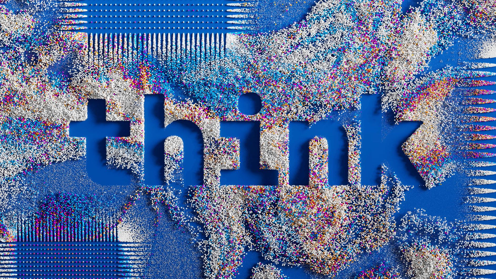
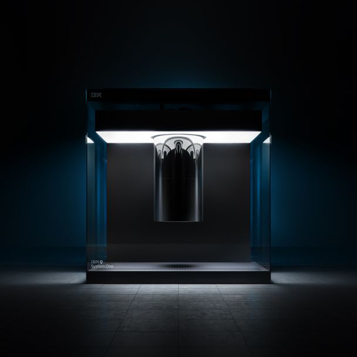
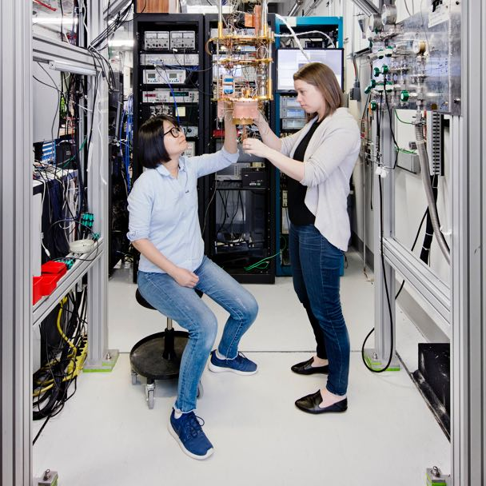
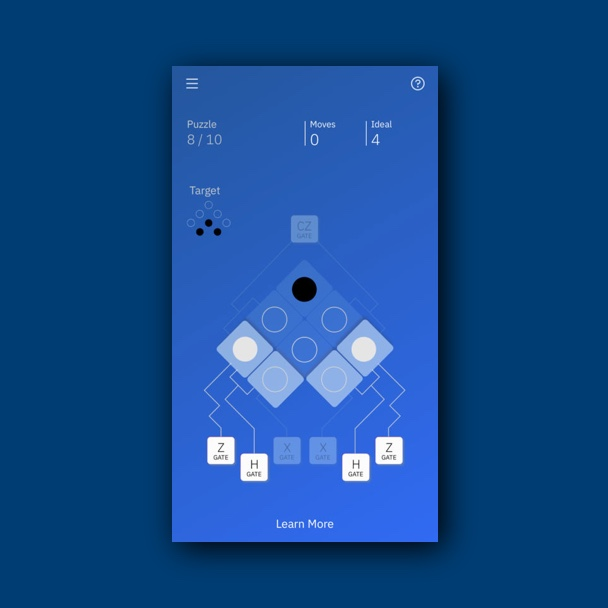
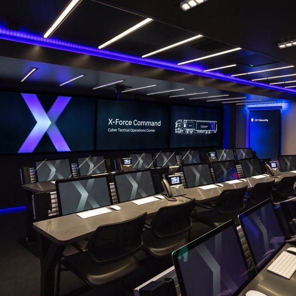
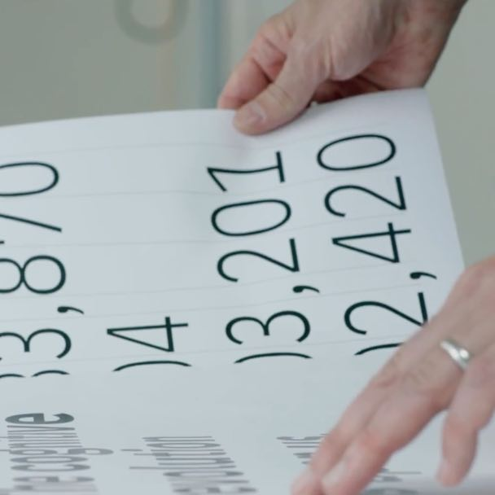

<title-block>
Design is simply 
the means. 
Business outcomes
 are the goal.
</title-block>

<grid background="gray-10">
<column lg="8" md="5">

In a world where every challenge is complex and unique, good design values unity over uniformity. Explore some of the different outcomes we’ve delivered for our clients and users.

<icon name="PlexArrowDown"></icon>

</column>
</grid>

<grid background="gray-10">
<column lg="16">

</column>
<column lg="4">

### America by Design

</column>

<column lg="12">

<tile title_size="small" icon="arrowRight" title="IBM Design featured on TV series America by Design" href="/impact/abd">

  </tile>

</column>

</grid>

<grid background="gray-10">
<column lg="16">

</column>
<column lg="4">

### Racial Equity in Design

</column>

<column lg="12">

<tile title_size="small" title="It’s about time we ask the tough questions that lead to transformation" href="https://www.ibm.com/design/racial-equity-in-design">

  </tile>

</column>

</grid>

<grid background="gray-10">
<column lg="16">

</column>
<column lg="4">

### AI Design

</column>

<column lg="12">

  <tile title_size="small" title="Everyone can play a role in how their team innovates with AI" href="https://www.ibm.com/design/thinking/page/badges/ai">
    

  </tile>

</column>

</grid>
<grid background="gray-10">
<column lg="16">

</column>
<column lg="4">

### Think

</column>

<column lg="12">

  <tile title_size="small" icon="arrowRight" title="Business leaders, visionaries, and innovators unite" href="/impact/think/">
    

  </tile>

</column>

</grid>
<grid background="gray-10">
<column lg="16">

</column>
<column lg="4" md="8">

### Quantum

</column>

<column lg="4"  md="4">
  <tile title_size="small" title="Gallery: Quantum computing" href="/impact/quantum/">
    
  </tile>

</column>
<column lg="4"  md="4">

  <tile title_size="small" title="Inside the world’s first quantum computer" href="https://techcrunch.com/2019/01/08/ibm-unveils-its-first-commercial-quantum-computer/">
    
  </tile>

</column>
<column lg="4" md="4" offset_lg="0"  offset_md="4">

  <tile title_size="small" title="Teaching quantum computing through a mobile game" href="https://thenextweb.com/apps/2018/07/23/ibms-hello-quantum-is-a-devilishly-difficult-puzzle-game-about-qubits/">
    
  </tile>

</column>
</grid>
<grid background="gray-10">
<column lg="16">

</column>
<column lg="4" md="8">

### Security

</column>

<column lg="4" md="4">
  <tile title_size="small" title="Gallery: IBM Security" href="/impact/security/">
    
  </tile>

</column>
<column lg="4" md="4">

  <tile title_size="small" title="Using data visualization to spot cyber threats" href="https://qz.com/984707/the-people-who-fight-hacking-and-cybercrime-are-turning-to-designers-for-help/">
    
  </tile>

</column>
<column lg="4" md="4" offset_lg="0"  offset_md="4">

  <tile title_size="small" title="Video: Building a security operations center on wheels" href="https://www.youtube.com/watch?v=yrI8S1906Ug">
    
  </tile>

</column>
</grid>

<grid background="gray-10">
<column lg="16">

</column>
<column lg="4" md="8">

### Plex

</column>

<column lg="4" md="4">
  <tile title_size="small" title="Gallery: Plex typeface" href="/impact/plex/">
    
  </tile>

</column>
<column lg="4" md="4">

  <tile title_size="small" title="2018 Typeface design competition: Plex wins Judges’ Choice" href="https://www.tdc.org/competitions/typeface-design-2018/">
    
  </tile>

</column>
<column lg="4" md="4" offset_lg="0"  offset_md="4">

  <tile title_size="small" title="The business case for an open source font" href="https://qz.com/1124664/ibm-plex-with-its-first-ever-custom-corporate-font-ibm-is-freeing-itself-from-the-tyranny-of-helvetica/">
    
  </tile>

</column>
</grid>
