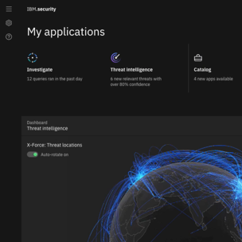

<title-block>
Design is simply 
the means. 
Business outcomes
 are the end.
</title-block>

<grid background="gray-10">
<column lg="8">

The true measure of design is the extent to which it solves real problems for real people. Explore some of the outcomes we’ve driven for our users and clients below.

<icon name="ArrowDown32"></icon>

</column>
</grid>

<grid background="gray-10">
<column lg="4">

### Think

</column>

<column lg="4" md="4">
  
  <tile name="Not what you expect from a tech conference" caption="impact/think" href="/impact/template/">
    
  </tile>

</column>

</grid>
<grid background="gray-10">
<column lg="4">

### Quantum

</column>

<column lg="4" md="4">
  <tile name="IBM Q, System One" caption="impact/quantum" href="/impact/template/">
    
  </tile>

</column>
<column lg="4" md="4">

  <tile name="Glimpses of an actual quantum computer" caption="fossbytes" href="/impact/template/">
    
  </tile>

</column>
<column lg="4" md="4">

  <tile name="This mobile app teaches quantum computing through a puzzle game" caption="thenextweb" href="/impact/template/">
    
  </tile>

</column>
</grid>
<grid background="gray-10">
<column lg="4">

### Think

</column>

<column lg="4" md="4">
  <tile name="Security Design at IBM" caption="impact/security" href="/impact/template/">
    
  </tile>

</column>
<column lg="4" md="4">

  <tile name="Using data visualization to spot cyber threats" caption="quartz" href="/impact/template/">
    
  </tile>

</column>
<column lg="4" md="4">

  <tile name="X-Force Command takes their immersive cybersecurity training on the road" caption="nytimes" href="/impact/template/">
    
  </tile>

</column>
</grid>

<grid background="gray-10">
<column lg="4">

### Plex

</column>

<column lg="4" md="4">
  <tile name="A typeface with a story" caption="impact/plex" href="/impact/template/">
    
  </tile>

</column>
<column lg="4" md="4">

  <tile name="Why a 2018 Typeface Design Competition judge voted for Plex" caption="tdc/news" href="/impact/template/">
    
  </tile>

</column>
<column lg="4" md="4">

  <tile name="The business case for our open source font" caption="source" href="/impact/template/">
    
  </tile>

</column>
</grid>
