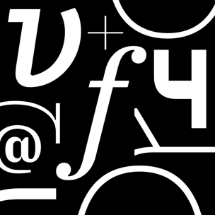
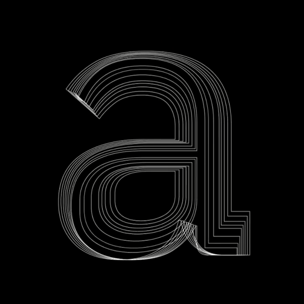
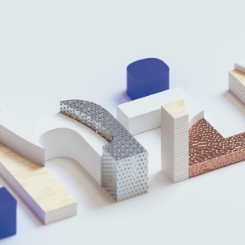

<title-block>
Design is simply 
the means. 
Business outcomes
 are the end.
</title-block>

<grid background="gray-10">
<column lg="10">

The true measure of design is the extent to which it solves real problems for real people. Explore some of the outcomes we’ve driven for our users and clients below.

<icon icon="ArrowDown32"></icon>

</column>
</grid>

<grid background="gray-10">
<column lg="4">

### Security

</column>

<column lg="4" md="4">
  <tile tile_name="Prioritizing both easy-of-use and security" tile_optional="medium.com" tile_href="http://www.google.com">
    
  </tile>

</column>
<column lg="4" md="4">

  <tile tile_name="" tile_optional="" tile_href="">
    
  </tile>

</column>
<column lg="4" md="4">

  <tile tile_name="" tile_optional="" tile_href="">
    
  </tile>

</column>
</grid>
<grid background="gray-10">
<column lg="4">

### Sports and Entertainment

</column>

<column lg="4" md="4">
  <tile tile_name="" tile_optional="" tile_href="">
    
  </tile>

</column>
<column lg="4" md="4">

  <tile tile_name="" tile_optional="" tile_href="">
    
  </tile>

</column>
<column lg="4" md="4">

  <tile tile_name="" tile_optional="" tile_href="">
    
  </tile>

</column>
</grid>
<grid background="gray-10">
<column lg="4">

### IBM Plex Typeface

</column>

<column lg="4" md="4">
  <tile tile_name="" tile_optional="" tile_href="">
    
  </tile>

</column>
<column lg="4" md="4">

  <tile tile_name="" tile_optional="" tile_href="">
    
  </tile>

</column>
<column lg="4" md="4">

  <tile tile_name="" tile_optional="" tile_href="">
    
  </tile>

</column>
</grid>

<grid background="gray-10">
<column lg="4">

### Quantum
<!-- -->
</column>

<column lg="4" md="4">
  <tile tile_name="" tile_optional="" tile_href="">
    
  </tile>

</column>
<column lg="4" md="4">

  <tile tile_name="" tile_optional="" tile_href="">
    
  </tile>

</column>
<column lg="4" md="4">

  <tile tile_name="" tile_optional="" tile_href="">
    
  </tile>

</column>
</grid>

<grid background="gray-10">
<column lg="4">

### Health
<!-- -->
</column>

<column lg="4" md="4">
  <tile tile_name="" tile_optional="" tile_href="">
    
  </tile>

</column>
<column lg="4" md="4">

  <tile tile_name="" tile_optional="" tile_href="">
    
  </tile>

</column>
<column lg="4" md="4">

  <tile tile_name="" tile_optional="" tile_href="">
    
  </tile>

</column>
</grid>
<grid background="gray-10">
<column lg="4">

### Energy

</column>

<column lg="4" md="4">
  <tile tile_name="" tile_optional="" tile_href="">
    
  </tile>

</column>
<column lg="4" md="4">

  <tile tile_name="" tile_optional="" tile_href="">
    
  </tile>

</column>
<column lg="4" md="4">

  <tile tile_name="" tile_optional="" tile_href="">
    
  </tile>

</column>
</grid>
