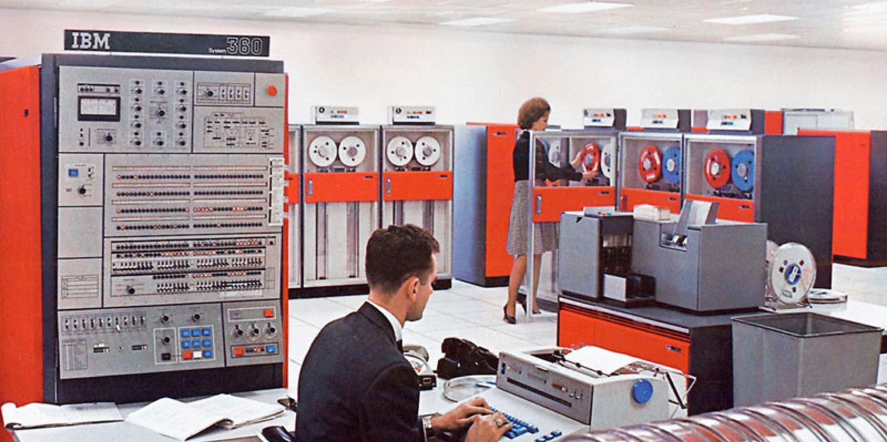
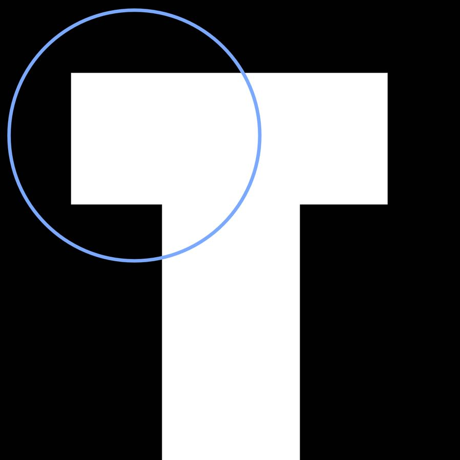
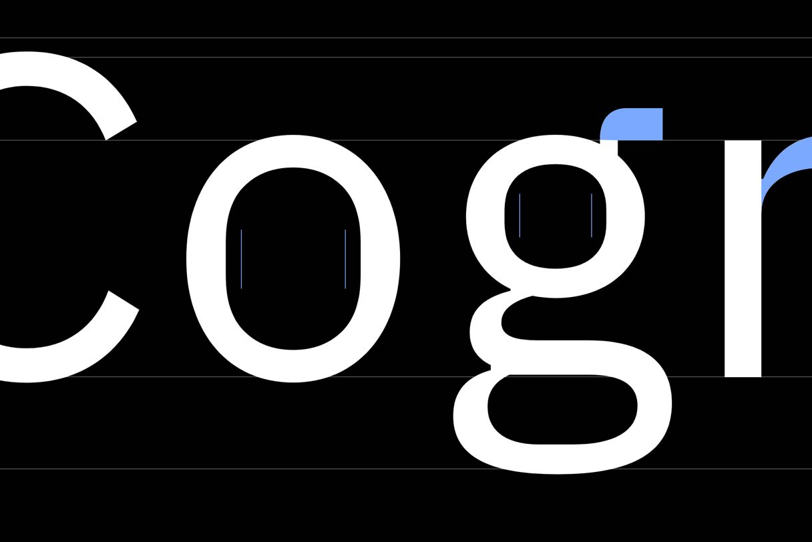
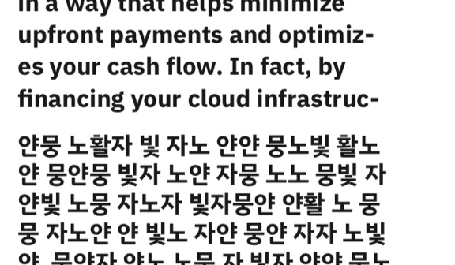
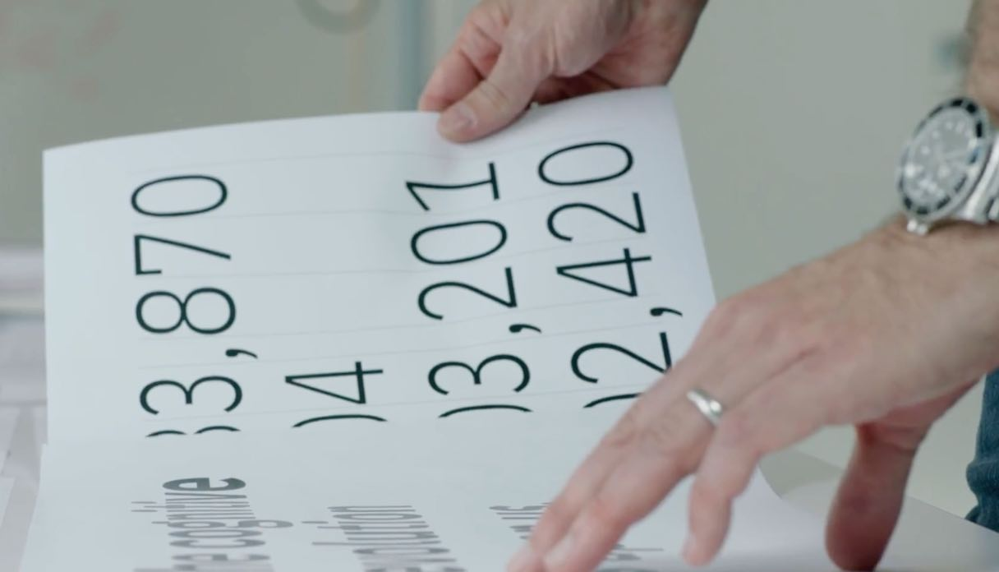
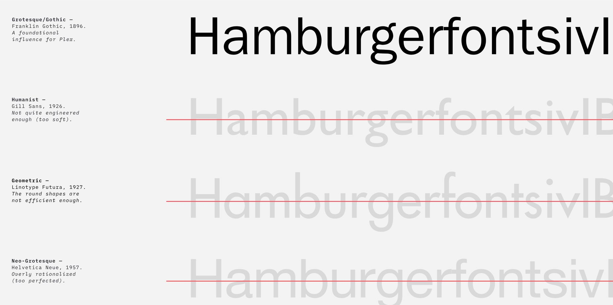
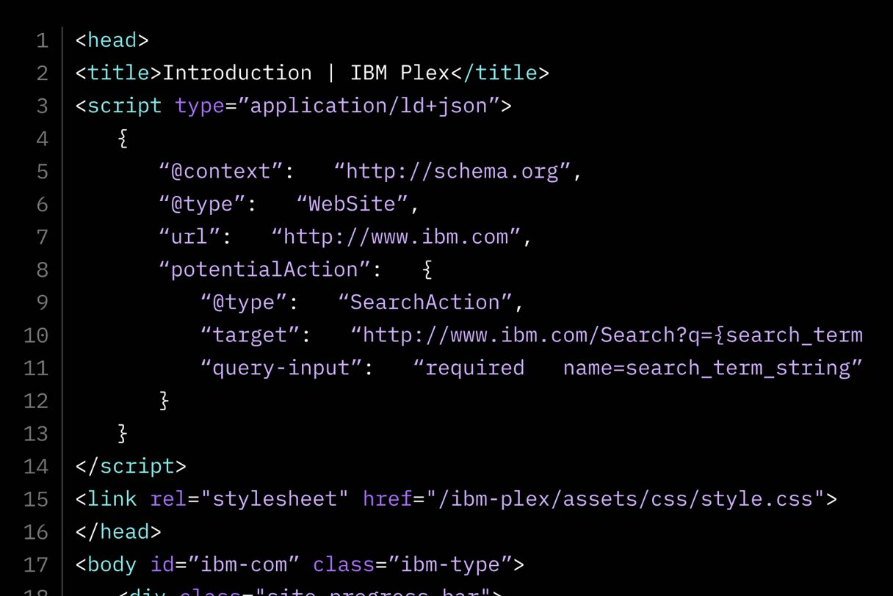
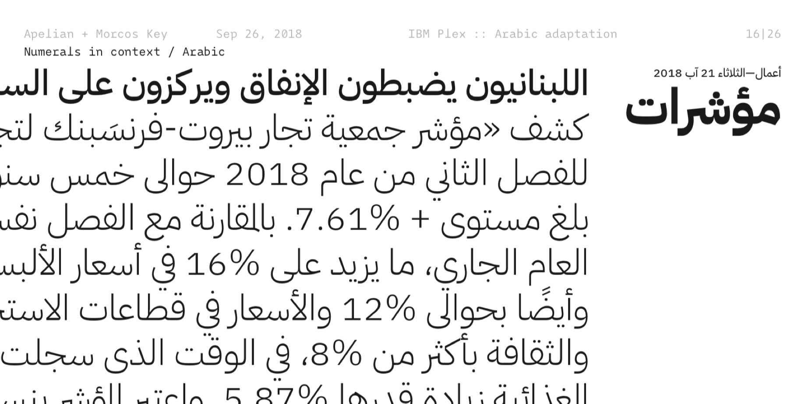

<back-link to="/impact">Impact Stories</back-link>

<grid classname="background-bleed">
<column lg="16">

</column>
</grid>

<grid background="gray-10">
<column md="2" lg="4">

### Plex

</column>

<column md="5" lg="8">

For decades, we’ve relied on typefaces like Helvetica to convey our messages at IBM. While practical, the use of these fonts became more and more pervasive over time, eroding the distinction that made them valuable in the first place; we needed a typeface that was unmistakably IBM.

In 2018, we introduced the world to Plex: IBM’s first-ever bespoke typeface. Plex is an open-source, global typeface that covers over 100 different languages. Inspired by IBM’s brand spirit and history, Plex’s letterforms embody the unique relationship between man and machine, striking a balance between the natural and the engineered; the emotional and rational; the classic and the cutting-edge.

The family includes a Sans, Sans Condensed, Mono, and Serif available in eight different weights, making it flexible and versatile enough to handle print, web, mobile, and everything in between.

<icon name="PlexArrowDown"></icon>

</column>
</grid>

<grid background="gray-10">
<column bleed={true} lg="12" offset_lg="4" fade="true">

</column>
<column bleed={true} md="4" lg="6" offset_lg="4">

</column>
<column bleed={true} md="4" lg="6" fade="true">

</column>
<column bleed={true} md="4" lg="8" offset_lg="4" fade="true">

</column>
<column bleed={true} md="4" lg="4" fade="true">

</column>
<column bleed={true} md="5" lg="4" offset_lg="4" fade="true">

</column>
<column bleed={true} md="3" lg="8" fade="true">

</column>
<column bleed={true} md="3" lg="12" offset_lg="4" fade="true">

</column>
<column bleed={true} md="5" lg="4" offset_lg="4" fade="true">

</column>
<column bleed={true} md="5" lg="8" fade="true">

</column>
<column bleed={true} md="8" lg="12" offset_lg="4" fade="true">

</column>
</grid>
