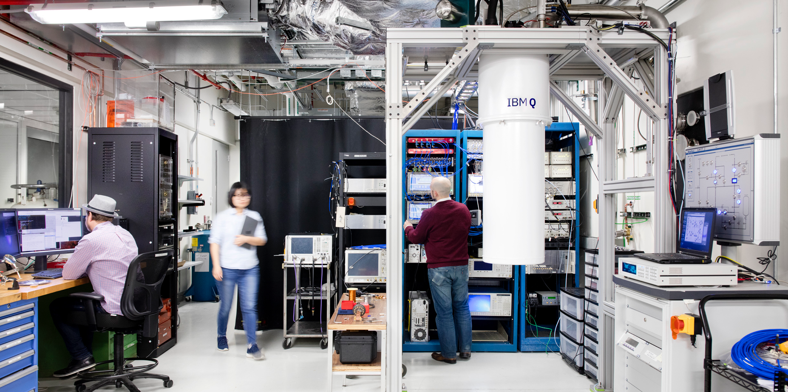
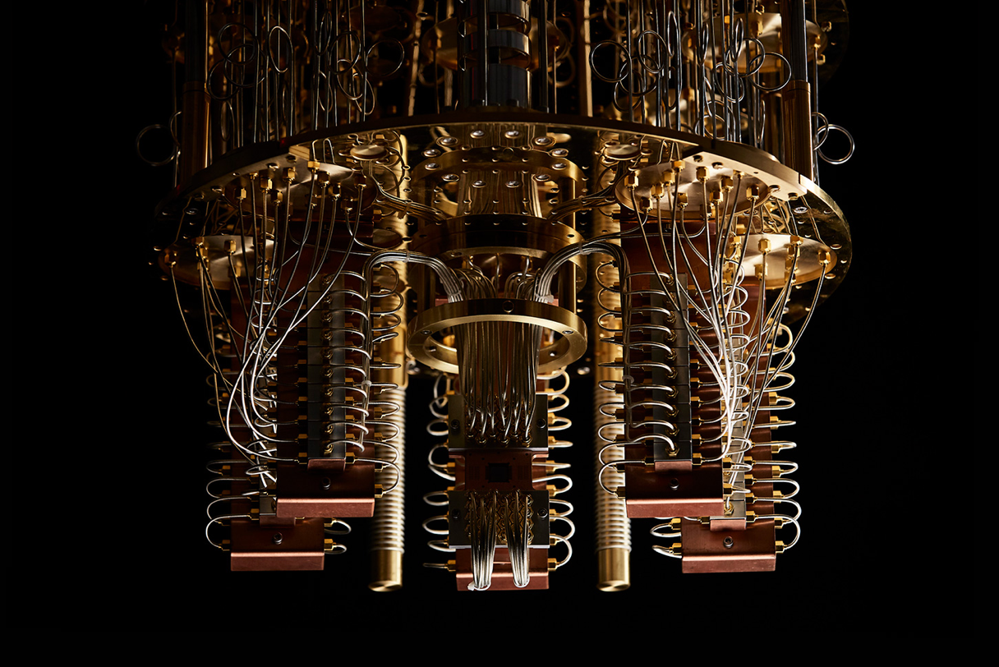
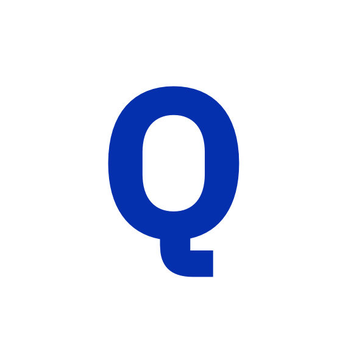
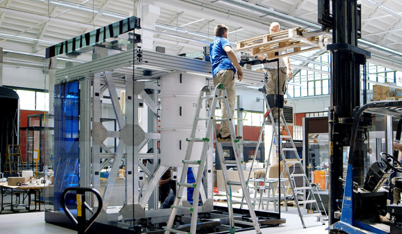
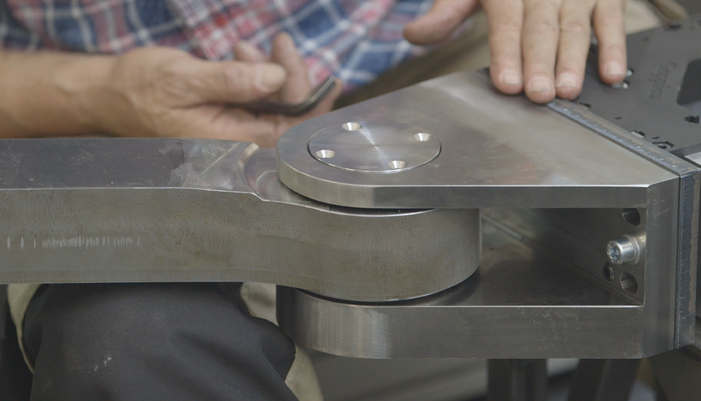
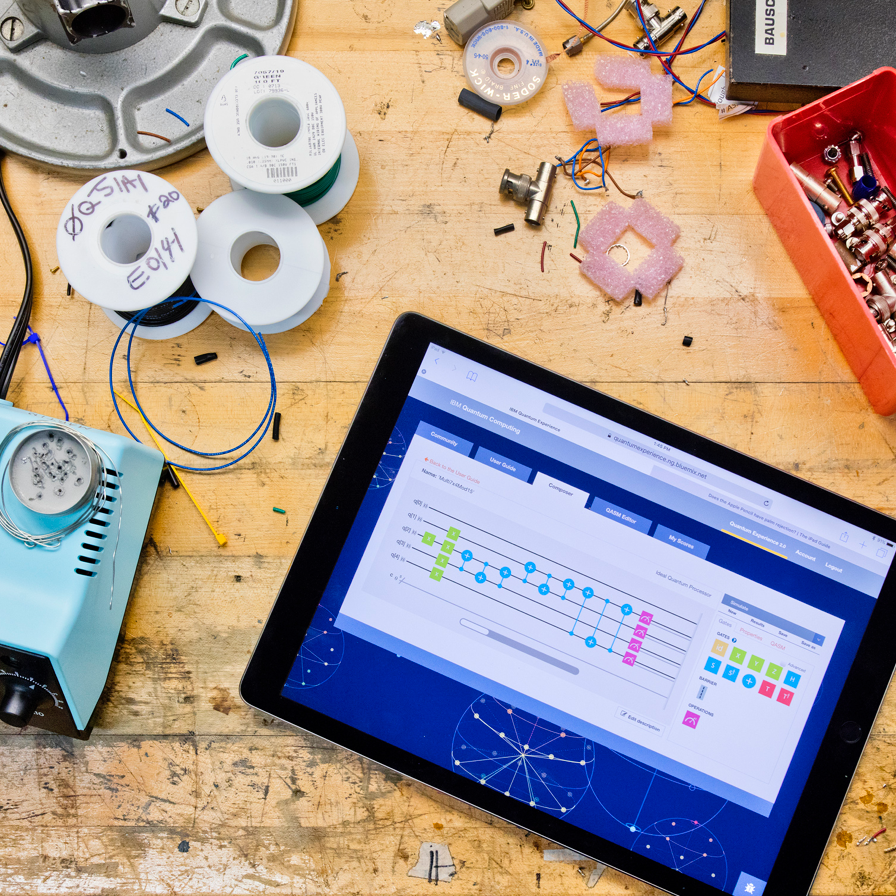
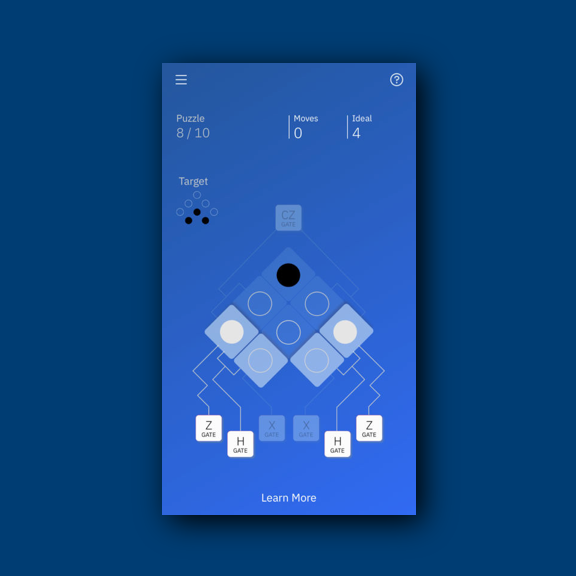

<grid className="background--nopadding">
<column lg="16">

<a href="/impact"><icon name="PlexArrowLeft"></icon>Impact Stories</a>

</column>
</grid>

<grid classname="background-bleed">
<column lg="16">

</column>
</grid>

<grid background="gray-10">
<column md="2" lg="4">

### Quantum

</column>

<column md="5" lg="8">

How do you turn a bleeding edge technology into something that is elegant, approachable and valuable for users, even as the technology itself continues to mature?

Rather than balking at the challenge, we’ve embraced the opportunity to be trailblazers for Qauntum computing, a transformational technology that will change the way we work for decades to come.  Whether it’s fabricating an industrial design capable of housing components that have to be kept colder than the temperature of deep space, or creating a mobile app that makes quantum physics understandable to teenagers, Quantum is the ultimate test of our ability to blend design expertise with deep domain knowledge to create real value for our users.

<icon name="ArrowDown32"></icon>

</column>
</grid>

<grid background="gray-10">
<column bleed={true} lg="12" offset_lg="4">

</column>
<column bleed={true} md="5" lg="8" offset_lg="4">

</column>
<column bleed={true} md="3" lg="4">

</column>
<column bleed={true} md="4" lg="6" offset_lg="4">

</column>
<column bleed={true} md="4" lg="6">

</column>
<column bleed={true} md="5" lg="8" offset_lg="4">

</column>
<column bleed={true} md="3" lg="4">

</column>
<column bleed={true} md="3" lg="4" offset_lg="4">

</column>
<column bleed={true} md="5" lg="8"">

</column>
<column bleed={true} md="5" lg="8" offset_lg="4">

</column>
</grid>
