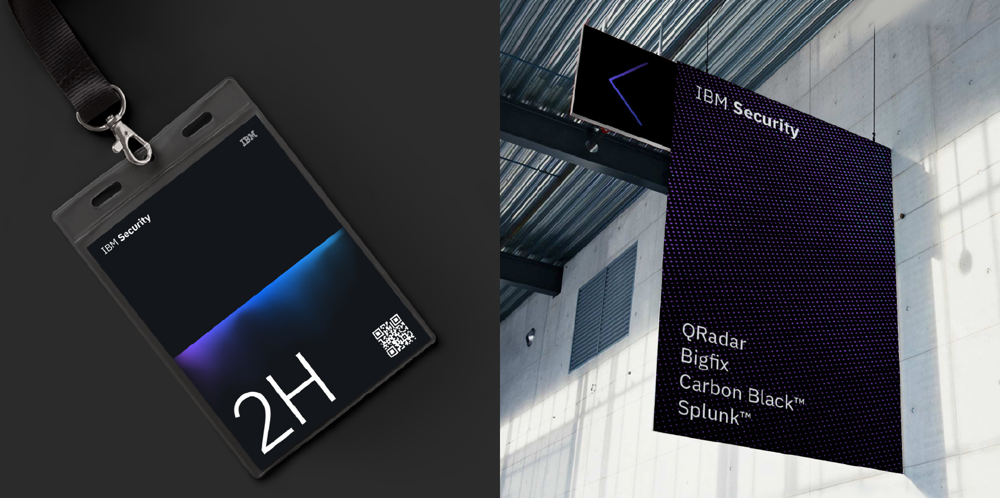
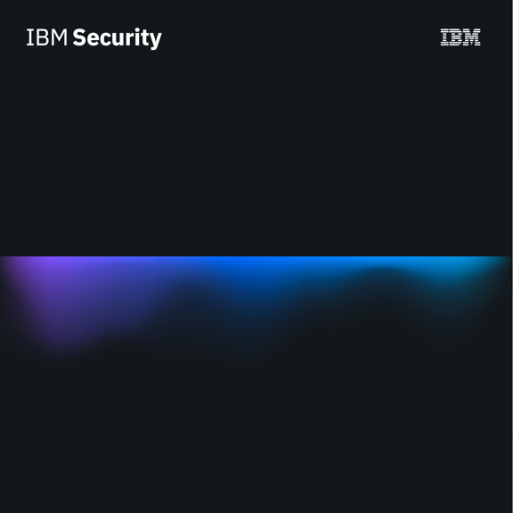
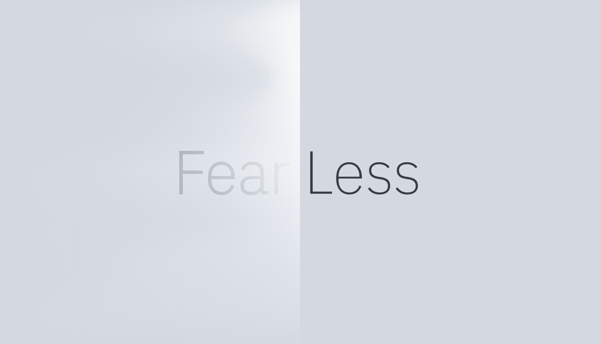
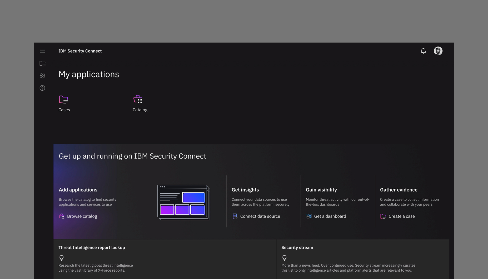
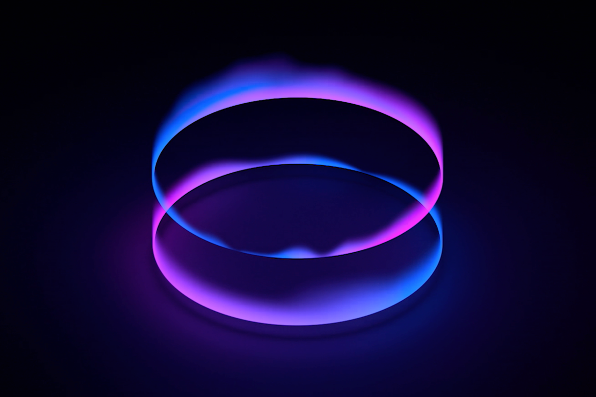
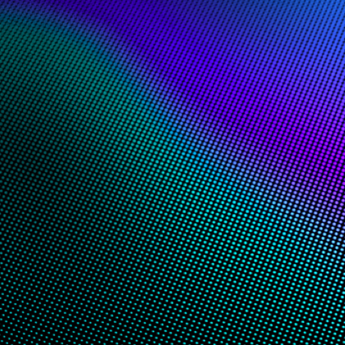

<grid className="background--nopadding">
<column lg="16">

<a href="/impact"><icon name="PlexArrowLeft"></icon>Impact Stories</a>

</column>
</grid>

<grid classname="background-bleed">
<column lg="16">

</column>
</grid>

<grid background="gray-10">
<column md="2" lg="4">

### Security

</column>

<column md="5" lg="8">

Cybersecurity is often thought of as a predominantly technical problem space. In reality, however, security is a complex web of interdependent factors, many of which are directly tied to human behaviors and habits.

Designing for security means constantly considering the high-pressure, high-risk environment in which these tools are actually being used.  For a security professional, the best user experience is one that is predictable, transparent and explicit about exactly what’s going on at all times. The ultimate goal: to take complex, sensitive operations and make them clear, consistent, and reliable for our end users.

<icon name="PlexArrowDown"></icon>

</column>
</grid>

<grid background="gray-10">
<column bleed={true} lg="12" offset_lg="4">

</column>
<column bleed={true} md="5" lg="8" offset_lg="4">

</column>
<column bleed={true} md="3" lg="4">

</column>
<column bleed={true} md="4" lg="6" offset_lg="4">

</column>
<column bleed={true} md="4" lg="6">

</column>
<column bleed={true} md="5" lg="8" offset_lg="4">

</column>
<column bleed={true} md="3" lg="4">

</column>
<column bleed={true} md="3" lg="4" offset_lg="4">

</column>
<column bleed={true} md="5" lg="8"">

</column>
</grid>
