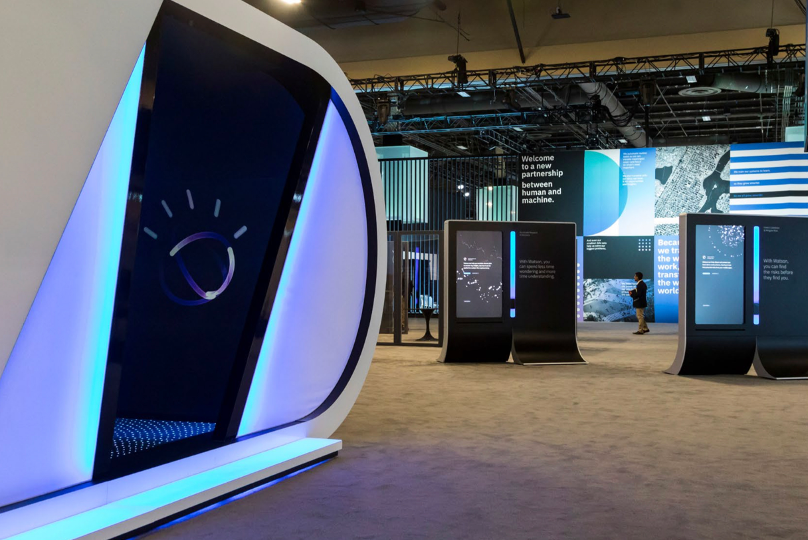
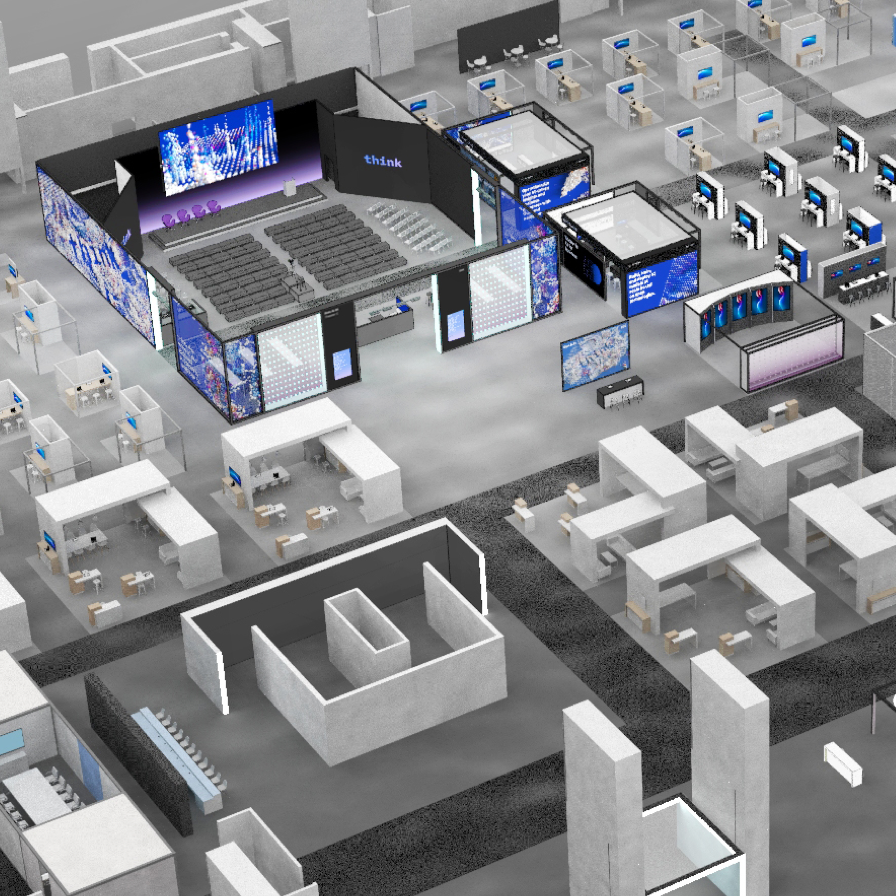
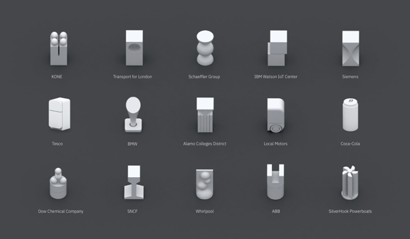
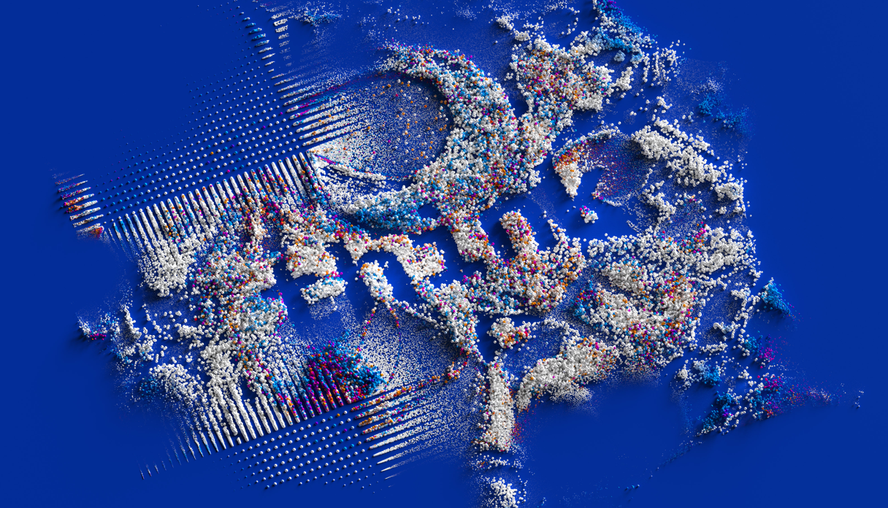

<grid className="background--nopadding">
<column lg="16">

<icon className="icon--left" color="blue" name="ArrowLeft24" inline="true"></icon>  <a href="/impact">Impact Stories</a>

</column>
</grid>

<grid classname="background-bleed">
<column lg="16">

</column>
</grid>

<grid background="gray-10">
<column md="2" lg="4">

### Think

</column>

<column md="5" lg="8">

Once a year, all of IBM unites for a one-week event that brings together clients, partners, IBMers and visionaries from around the world.

The experiences offered at Think are as diverse as they are numerous, including interactive exhibitions, Think tanks, research demos, live entertainment and beyond. By leveraging the IBM Design Language for everything from the layout of the expo floor to iconography and booth design, Think unifies thousands of individual sessions, creating a cohesive end-to-end experience that is distinctly IBM.

<icon name="ArrowDown32"></icon>

</column>
</grid>

<grid background="gray-10">
<column bleed={true} lg="12" offset_lg="4">

</column>
<column bleed={true} md="5" lg="8" offset_lg="4">

</column>
<column bleed={true} md="3" lg="4">

</column>
<column bleed={true} md="4" lg="6" offset_lg="4">

</column>
<column bleed={true} md="4" lg="6">

</column>
<column bleed={true} md="5" lg="8" offset_lg="4">

</column>
<column bleed={true} md="3" lg="4">

</column>
<column bleed={true} md="3" lg="4" offset_lg="4">

</column>
<column bleed={true} md="5" lg="8"">

</column>
<column bleed={true} md="5" lg="8" offset_lg="4">

</column>
<column bleed={true} md="3" lg="4">

</column>
<column bleed={true} md="5" lg="8" offset_lg="4">

</column>
</grid>
