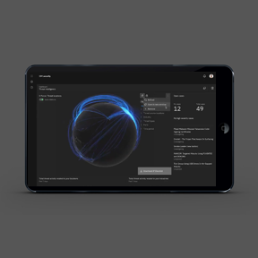
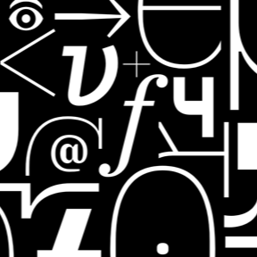
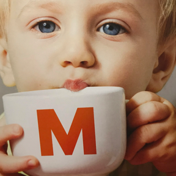

<title-block>
The purpose of 
everything we design 
is to guide the people 
we serve.
</title-block>

<grid background="gray-10">
<column lg="8">

When you blend human-centered design with time-tested business acumen and deep domain expertise, the results are palpable.

</column>
</grid>

<grid background="gray-10">
<column lg="4">

### Featured
<!-- -->
</column>
<column lg="4" md="4">

<tile
      type="small"
      tile_title_one="IBM Security"
      description="Detection is at an all time high and breaches at an all time low"
      link_one="Read more">
      
    </tile>

</column>
<column lg="4" md="4">

<tile
      type="small"
      tile_title_one="IBM Plex"
      description="Our typeface launched earlier this year and is now going global"
      link_one="Read more">
      
    </tile>

</column>
<column lg="4" md="4">

  <tile
      type="small"
      tile_title_one="iX + Migros"
      description="An integrated experience for Switzerland's most popular brand"
      link_one="Read more">
          
    </tile>

</column>
</grid>
