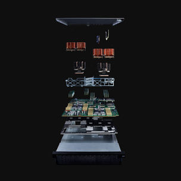

<title-block>
The purpose of 
everything we do 
is to guide the 
people we serve.
</title-block>

<grid background="gray-white">
<column lg="16">

<iframe src="https://player.vimeo.com/video/293453905?title=0&byline=0&portrait=0?color=ff0000" width="500" height="281" frameborder="0" webkitallowfullscreen mozallowfullscreen allowfullscreen />

</column>
</grid>

<grid background="gray-10">
<column lg="8">

When we blend human-centered design
with time-tested business acumen, the results speak for themselves.

<icon name="ArrowDown32"></icon>

</column>
</grid>

<grid background="gray-10">
<column lg="16">

</column>
<column lg="4">

### Today

</column>

<column lg="4" md="4">

<tile
    caption="impact/quantum"
    name="IBM Q, System One">

</tile>

</column>
<column lg="4" md="4">

<tile
    caption="impact/security"
    name="Security Design at IBM">

</tile>

</column>
<column lg="4" md="4">

<tile
    caption="tdc/news"
    name="Why a 2018 Typeface Design Competition judge voted for Plex  ">

</tile>

</column>
<column lg="4" offset_lg="12" text_align="right">

[View more](/impact)

</column>

</grid>
