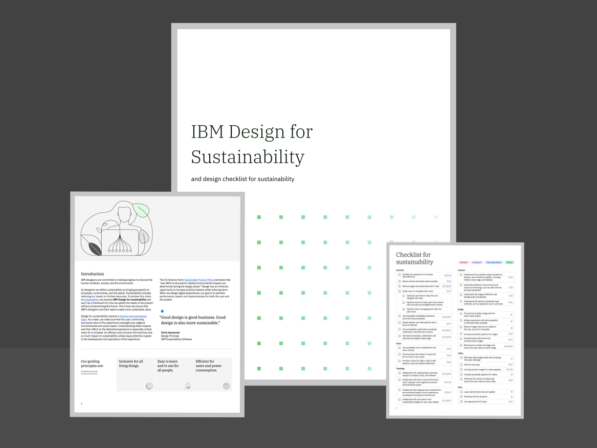

<back-link to="/practices">Practices</back-link>

<grid background="gray-10">

<column lg="8" md="4" sm="4">

    <h1>IBM Design  for sustainability</h1>

    
Explore IBM Design's approach  to designing for sustainability

    <a href="design-for-sustainability-positionpaper.pdf" download><button class="carbon--button">Download<svg focusable="false" preserveAspectRatio="xMidYMid meet" aria-label="" xmlns="http://www.w3.org/2000/svg" fill="currentColor" width="24" height="24" viewBox="0 0 32 32" aria-hidden="true" style="will-change: transform;"><path d="M26 15l-1.41-1.41L17 21.17V2h-2v19.17l-7.59-7.58L6 15l10 10 10-10z"></path><path d="M26 24v4H6v-4H4v4a2 2 0 0 0 2 2h20a2 2 0 0 0 2-2v-4z"></path></svg></button></a>

</column>

<column lg="8" md="4" sm="4">

</column>

</grid>

<grid background="white">
<column lg="4" md="2">

### IBM Design for sustainability

</column>

<column md="5" lg="8">

Our purpose is to be the catalyst that makes the world work better.

IBM Design for sustainability articulates the collective viewpoint of IBM Designers about how we can acquire and apply sustainability consciousness.

<strong>IBM Design definition of sustainability</strong> As IBM Designers, we define sustainability as bringing prosperity to all people, communities, and the planet, both now and in the future. The positive impact of sustainability includes all living things, not just humans. It also includes reducing our impact on the limited resources of our planet.

<strong>Sustainability consciousness</strong> We make design choices every day, always in pursuit of best meeting our users’ needs. We consider the impact of those choices on society and on our planet, and our goal is that sustainability considerations are part of every design choice that we make.

<strong>Envisioning a better tomorrow</strong> We believe in optimism and are optimistic about a more sustainable future. We published our first version of IBM Design for sustainability to help our IBM Designers develop their sustainability consciousness. This first version is a prototype and we expect to iterate on it as our sustainability consciousness expands.

<icon name="PlexArrowDown"></icon>

</column>
<column lg="3" offset_lg="1" md="2" sm="0">

"Good design is good business. Good design is also more sustainable."

> **Chris Hammond**
 
Design Principal 
 
IBM Sustainability Software

</column>
</grid>

<grid background="gray-10">
<column lg="4">

### Our principles

Enabled by diverse empowered teams.

</column>
<column lg="12"  md="5">

<h2>Our guiding principles are that sustainability is:</h2>

</column>
<column lg="4" offset_lg="4" border="true"  md="5">

### **Inclusive for all   living things.**

_Have we understood the full impact of our designed experience for both people and other living things?_   Our experiences go beyond just being human-centered to encompass good stewardship of our planet’s limited resources for all living things, now and in the future.

</column>

<column lg="4" border="true"  md="5">

### **Easy to learn and to use   for all people.**

_Have we prioritized the usability of our experiences regardless of the user’s ability or means?_   Our experiences deliver ease-of-use for everyone, both the first time and every time.

</column>

<column lg="4" border="true"  md="5">

### **Efficient for users and   power consumption.**

_Have we collaborated with our team to optimize systems to reduce and increase user efficiency?_   Our experiences are simplified to be more inclusive, more efficient, and require fewer resources.

</column>

</grid>

<grid background="gray-10">
<column lg="16">

<tile
    href="design-for-sustainability-positionpaper.pdf"
    new_window="false"
    title="Download"
    feature="true"
    dark="true"
    icon="Download"
    feature_heading="IBM Design for sustainability position paper"
    feature_background="black">

</tile>
</column>
</grid>

<grid background="gray-10">

<column lg="4">

<h3>Learn more about  sustainability at IBM</h3>
</column>

<column lg="4" md="4">

##### Impact  

IBM's ESG framework: Environmental, Equitable, and Ethical Impact

<a href="https://www.ibm.com/impact">IBM Impact→</a>

</column>

<column lg="4" md="4">

##### Solutions

IBM’s Sustainability Solutions  and Products

<a href="https://www.ibm.com/sustainability">Sustainability solutions from IBM→</a>

</column>
<column lg="4" md="4">

##### Services 

IBM Consulting Sustainability Services

<a href="https://www.ibm.com/business-operations/services/sustainability">IBM Consulting Sustainability Services→</a>

</column>
</grid>

