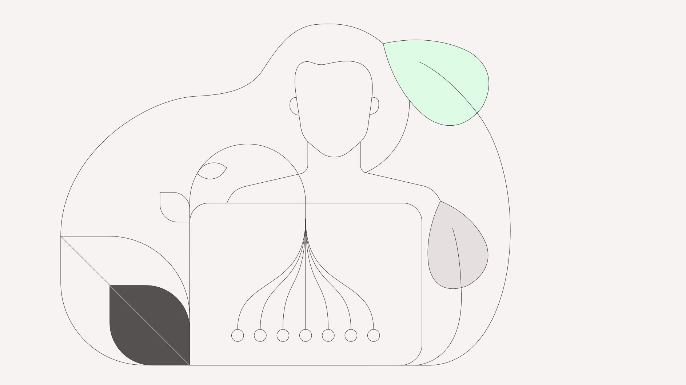

<title-block>

The strongest 
bonds are formed 
when aesthetic 
meets pragmatic.

<anchor-links>

<ul>
<li><a data-scroll href="#ibm-design-language">IBM Design Language</a></li>
<li><a data-scroll href="#enterprise-design-thinking">Enterprise Design Thinking</a></li>
<li><a data-scroll href="#ibm-design-for-ai">IBM Design for AI</a></li>  
<li><a data-scroll href="#ibm-accessibility">IBM Accessibility</a></li>  
<li><a data-scroll href="#ibm-design-research">IBM Design Research</a></li>
<li><a data-scroll href="#ibm-design-for-sustainability">IBM Design for sustainability</a></li>
</ul>

</anchor-links>

</title-block>

<grid background="gray-100">
<column lg="8" md="5">

Tap into a growing collection of design tools, assets, and resources to keep your business moving forward.

<icon name="PlexArrowDown" color="white"></icon>

</column>
</grid>
<grid background="gray-100">
<column lg="16">

</column>
<column lg="4" md="5">

### IBM Design Language

</column>
<column lg="7" md="5">

## Principles, guidelines, and ready-made assets to help you build exceptional experiences.

</column>

<column lg="12" offset_lg="4">

<tile
    href="https://www.ibm.com/design/language/"
    new_window="false"
    size="lg"
    background="#373737"
    dark="true"
    title="IBM Design Language">

</tile>

</column>
<column lg="4" md="4" offset_lg="4">

<tile
    href="https://www.carbondesignsystem.com"
    dark="true"
    title="Product Design System">

</tile>

</column>
<column lg="4" md="4">

<tile
    href="https://www.ibm.com/standards/web/"
    dark="true"
    title="Digital Design System">

</tile>

</column>
<column lg="4" md="4" offset_lg="0"  offset_md="4">

<tile
    href="https://www.ibm.com/plex/"
    dark="true"
    title="IBM Plex typeface">

</tile>

</column>
</grid>
<grid background="gray-100">
<column lg="16">

</column>
<column lg="4">

### Enterprise Design Thinking

</column>
<column lg="7" md="5">

## A scalable learning approach that combines online learning with in-person activation to make design thinking stick.

</column>
<column lg="12" offset_lg="4">

<tile
    href="https://www.ibm.com/design/thinking/"
    size="lg"
    background="#C5DEFF"
    dark="true"
    title="Enterprise Design Thinking">

</tile>
<tile
    href="https://www.ibm.com/design/thinking/page/badges/ai/"
    size="lg"
    background="#C5DEFF"
    dark="true"
    title="Enterprise Design Thinking for AI">

</tile>

</column>
</grid>
<grid background="gray-100">
<column lg="16">

</column>
<column lg="4" md="5">

### IBM Design for AI

</column>
<column lg="7" md="5">

## A collection of guidelines, resources, and ethics to give you what you need to design human-centric AI solutions.

</column>

<column lg="12" offset_lg="4">

<tile
    href="https://www.ibm.com/design/ai/"
    new_window="false"
    size="lg"
    background="#373737"
    dark="true"
    title="IBM Design for AI">

</tile>

</column>
<column lg="4" md="4" offset_lg="4">

<tile
    href="https://www.ibm.com/design/ai/fundamentals/"
    dark="true"
    title="AI Design Fundamentals">

</tile>

</column>
<column lg="4" md="4">

<tile
    href="https://www.ibm.com/design/ai/ethics/everyday-ethics/"
    dark="true"
    title="Everyday Ethics for AI">

</tile>

</column>
<column lg="4" md="4" offset_lg="0"  offset_md="4">

<tile
    href="https://www.ibm.com/design/ai/conversation/"
    dark="true"
    title="Conversation Design">

</tile>

</column>
</grid>
<grid background="gray-100">
<column lg="16">

</column>
<column lg="4">

### IBM Accessibility

</column>
<column lg="7" md="5">

## Resources and guidance crafted by IBM’s accessibility experts to help any product team deliver an accessible solution to the market.

</column>
<column lg="12" offset_lg="4">

<tile
    href="https://www.ibm.com/able/"
    new_window="false"
    size="lg"
    background="#F2BDD8"
    dark="true"
    title="IBM Accessibility">

</tile>

</column>

<grid background="gray-100">
<column lg="16">

</column>
<column lg="4">

### IBM Design Research

</column>
<column lg="7" md="5">

## Resources and guidance to help you drive actionable user insights through observation, experience, and making.

</column>
<column lg="12" offset_lg="4">

<tile
    href="https://www.ibm.com/design/research/"
    new_window="false"
    size="lg"
    background="#F2BDD8"
    dark="true"
    title="IBM Design Research">

</tile>

</column>

<grid background="gray-100">
<column lg="16">

</column>
<column lg="4">

### IBM Design for sustainability

</column>
<column lg="7" md="5">

## Principles, guidance, and resources to acquire and apply sustainability consciousness to everyday design.

</column>
<column lg="12" offset_lg="4">

<tile
    href="/practices/design-for-sustainability"
    new_window="false"
    size="lg"
    background="#F2BDD8"
    dark="true"
    icon="arrowRight"
    title="IBM Design for sustainability position paper">

</tile>

</column>
</grid>
