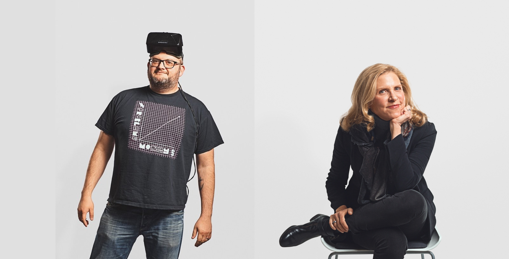
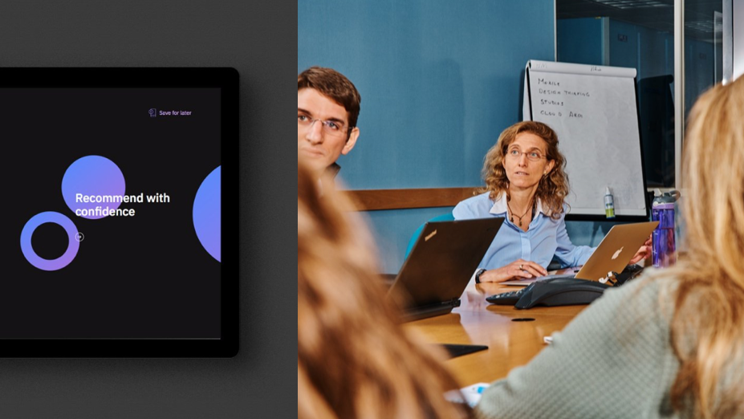
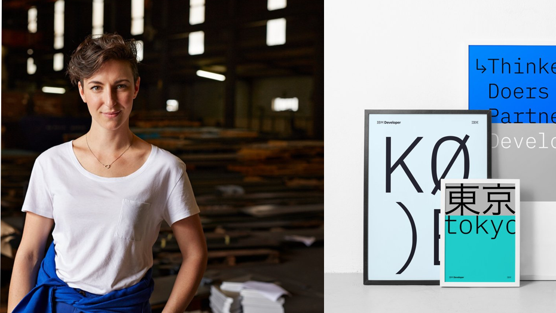

<title-block>

<anchor-links>

- [How we work](#how-we-work)
- [Dimensions of diversity](#dimensions-of-diversity)
- [Work with us](#work-with-us)

</anchor-links>

A solution’s quality hinges directly on 
the diversity of the team delivering it.

</title-block>

<grid background="gray-10">
<column lg="8">

<medium>The foundational unit of design is the team. Learn how we leverage diversity to strengthen our teams and explore the types of roles we hire for.</medium>

</column>

<column lg="16">

</column>
<column lg="4">

## Diverse teams

</column>
<column lg="10">

<large>When solving complex, multi-faceted problems, we rely on the strength of Diverse Empowered Teams to envision and execute on solutions that generate value  for both our users and our clients. 
  Diversity comes in many forms-your job role, your educational history, your cultural background-all are important, and all are crucial to a team’s ability to deliver robust, differentiated outcomes.</large>

</column>
</grid>

<grid background="gray-10">
<column lg="4">

## Dimensions of diversity

</column>
<column lg="4">

### Identity
- Age and Ability
- Gender identity
- Race and ethnicity

</column>
<column lg="4">

### Experience
- Cultural upbringing
- Geography
- Language

</column>
<column lg="4">

### Expertise
- Education
- Organization
- Discipline

</column>
</grid>
<grid background="black">
<column lg="10">

## Join us
<large>
Ready to become part of the single-largest design initiative in the world?   We’re always looking for talented, ambitious individuals to join us in our mission. Check out the practices below and blah blah blah.
</large>

</column>

<column offset_lg="2" lg="4">

<anchor-links>

- [Product and digital](#product-and-digital)
- [Brand and marketing](#brand-and-marketing)
- [Service design](#service-design)

</anchor-links>
</column>
<column lg="10">

</column>
<column lg="8">

## Product and digital
Are you a sucker for screens, wireframes and user experience? Work with multi-disciplinary teams of designers, developers, offering managers and beyond to design (and, at times, redesign) some of IBM’s most foundational products and webpages.

Types of role: visual design, UX design, user research, front-end development, content design and strategy, offering management

[View open roles](#)

</column>
<column offset_lg="4" lg="4">

> We’re designing experiences that don’t exist yet. Because of that, we’re constantly innovating and improving what we’re making. It’s an amazing challenge, and it’s also incredibly rewarding.

> — Amritha Prasad, Product Designer

</column>
<column lg="10">

</column>
<column lg="8">

## Brand and marketing
Do you get excited by the idea of influencing how one of the world’s largest and most storied companies shows up in the world? Team up with talented graphic designers, creative copywriters and some of the sharpest marketing minds out there to help sharpen and promote IBM’s brand identity.

Types of role: graphic design, content and copywriting, front-end development, communications, PR, marketing

[View open roles](#)

</column>
<column offset_lg="4" lg="4">

> I joined because I liked that IBM was building creative teams and sharing their design process. I’m very excited to learn from my experienced peers and grow alongside the team.

> — Alice Yang, Illustrator

</column>
<column lg="10">

</column>
<column lg="8">

## Service design
Are you a creative critical thinker with a strong passion for business? Work directly with clients, partnering with IBM consultants and business strategists to drive outcomes that create both market impact and user impact.

Types of role: graphic design, content design, business strategy, 
user and market research, consulting

[View open roles](#)

</column>
<column offset_lg="4" lg="4">

> We’re designing experiences that don’t exist yet. Because of that, we’re constantly innovating and improving what we’re making. It’s an amazing challenge, and it’s also incredibly rewarding.

> — Amritha Prasad, Product Designer

</column>
</grid>

