<title-block>

A solution’s quality hinges directly on 
the qualities of the team delivering it.

<anchor-links>

<ul>
<li><a data-scroll href="#diverse">Diverse</a></li>
<li><a data-scroll href="#embedded">Embedded</a></li>
<li><a data-scroll href="#co-creators">Co-creators</a></li>
<li><a data-scroll href="#find-your-team">Find your team</a></li>
</ul>

</anchor-links>

</title-block>

<grid background="gray-10">
<column lg="8" md="5">

The foundational unit of design is the
team. Learn how we leverage diversity
to strengthen our teams and deliver meaningful outcomes.

<icon name="PlexArrowDown"></icon>

</column>
</grid>
<grid background="gray-10">
<column lg="16">

</column>
<column lg="4" md="5">

### Diverse

</column>
<column lg="8" md="5">

## Complex, multi-faceted challenges demand diverse, multi-talented teams.

When tackling complex problems at scale, we rely on the strength of diverse multidisciplinary teams to envision and execute on solutions that generate value for both our users and our clients.

Diversity comes in many forms: your job role, your educational history, your cultural background—all are important, and all are crucial to a team’s ability to deliver robust, differentiated outcomes.

</column>
<column lg="8" offset_lg="4" md="5" fade="true">

</column>
<column lg="4" md="3" fade="true">

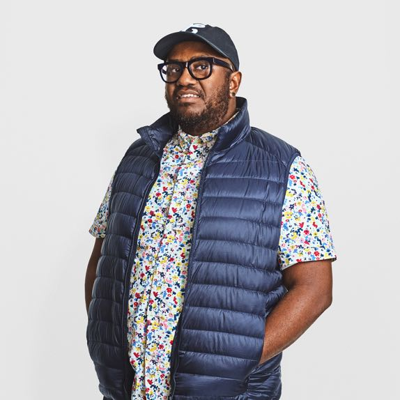

</column>

</column>
<column lg="4" offset_lg="4" md="3" fade="true">

</column>
<column lg="8" md="5" fade="true">

</column>
</grid>
<grid background="gray-10">
<column lg="12" offset_lg="4">

## The dimensions of diversity

</column>
<column lg="4" offset_lg="4" border="true" md="5">

### Identity

Age and ability  
Gender identity  
Race and ethnicity

</column>
<column lg="4" border="true" md="5">

### Experience

Cultural upbringing  
Geography  
Language

</column>
<column lg="4" border="true" md="5">

### Expertise

Education  
Organization  
Discipline

</column>
</grid>
<grid background="gray-10">
<column lg="4">

### Embedded

</column>
<column lg="8" md="5">

## Good design requires a deep understanding of the business domain that's being designed for.

Rather than siloing designers into a single organization, we distribute them throughout teams and business units across IBM.

Embedding designers directly into the business allows them to build a rigorous understanding of the domain they’re working in. This knowledge, in turn, helps them align and collaborate more effectively with developers, engineers, offering managers, and all of the other disciplines that must come together to deliver a great outcome.

</column>
<column lg="8" offset_lg="4" md="5" fade="true">

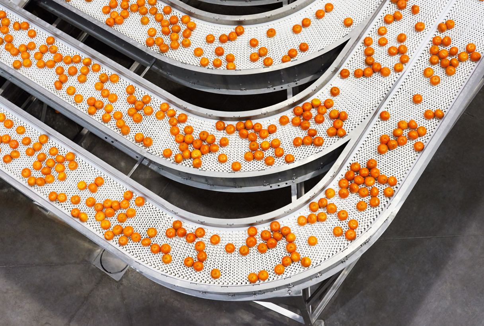

</column>
<column lg="4" md="3" fade="true">

</column>

</column>
<column lg="4" offset_lg="4" md="3" fade="true">

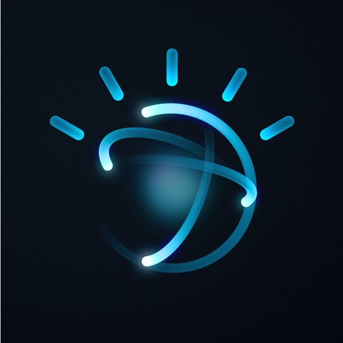

</column>
<column lg="8" md="5" fade="true">

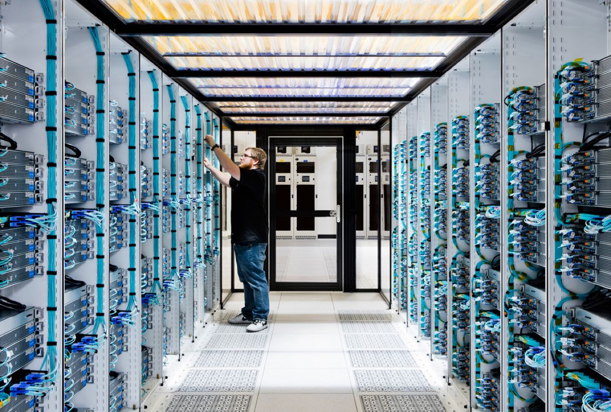

</column>
</grid>
<grid background="gray-10">
<column lg="4">

### Co-creators

</column>
<column lg="8" md="5">

## When users are intimately involved in the design process, you’re all but guaranteed to create something they love.

Human-centered design goes far beyond just speaking with a few people before you get started; it’s about truly co-creating with your business users and stakeholders by bringing them into the design process from Day 1.

From the initial visioning stages through to delivery and beyond, we work closely with both of these groups to ensure that every decision we make is rooted in a deep understanding of their goals and needs.

</column>
<column lg="8" offset_lg="4" md="5" fade="true">

</column>
<column lg="4" md="3" fade="true">

</column>

</column>
<column lg="4" offset_lg="4" md="3" fade="true">

</column>
<column lg="8" md="5" fade="true">

</column>
</grid>
<grid background="gray-100">
<column lg="7" md="5">

## Find your team

Ready to become part of the largest design initiative in the world?  We’re always looking for talented, ambitious individuals to join us in our mission. Learn more about the different ways design is practiced across IBM.

</column>

<column offset_lg="5" lg="4">

<anchor-links>

<ul>
<li><a data-scroll href="#product">Product</a></li>
<li><a data-scroll href="#brand">Brand</a></li>
<li><a data-scroll href="#services">Services</a></li>
</ul>

</anchor-links>

</column>
</grid>
<grid background="gray-100">
<column lg="16">

</column>
<column lg="4">

### Product

</column>
<column lg="8" md="5">

## Are you passionate about designing great software and digital experiences?

Work with multi-disciplinary teams of designers, developers, offering managers and beyond to design some of IBM’s most foundational products and webpages.

Types of roles: visual design, UX design, user research, front-end development, content design and strategy, offering management

<a href="https://careers.ibm.com/ListJobs/All/Search/Position-Type/Early-Professional/primary-job-category/Design---Offering-Management//?lang=en" target="_blank">Open roles <icon color="blue" name="ArrowUpRight20" inline="true"></icon></a>
 

</column>
<column lg="8" offset_lg="4" md="5">

<carousel id="c1" count="1 2 3 4">
  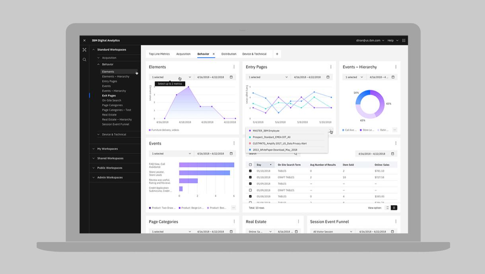
  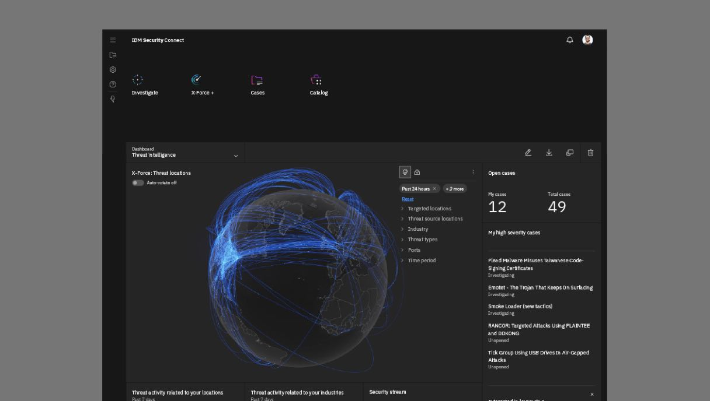
  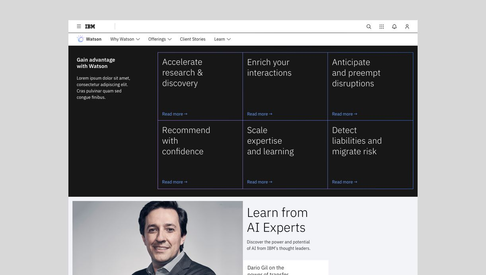
  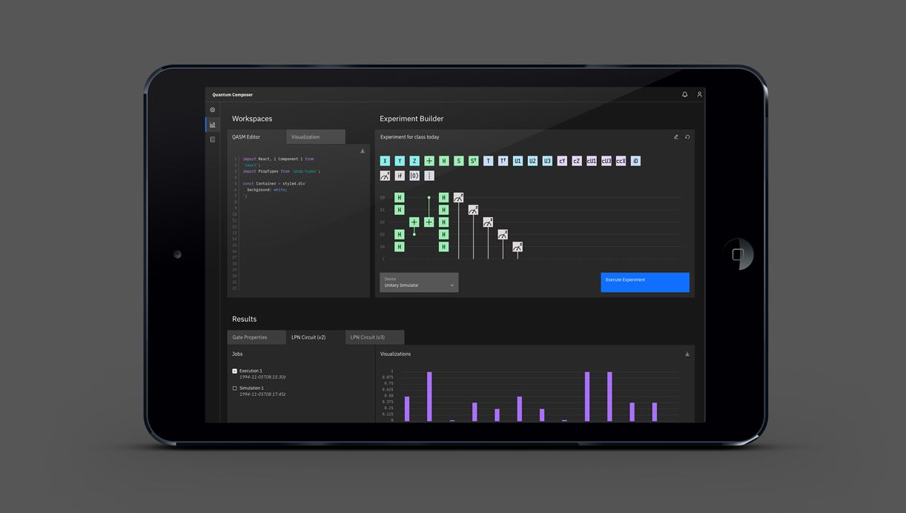
</carousel>

</column>
<column lg="3"  md="3"  md="3" sm="0">

> _We’re bridging data with previously disconnected experiences to accelerate how our customers get their jobs done. By augmenting their workflows and providing rich insights at just the right moment, we’re turning pain points into moments of delight._

> _***Cameron Calder***   UX Designer, IBM Security_

</column>
</grid>
<grid background="gray-100">
<column lg="16">

</column>
<column lg="4">

### Brand

</column>
<column lg="8" md="5">

## Do you get excited by the idea of influencing how one of the world’s largest and most storied companies shows up in the world?

Team up with talented graphic designers, creative copywriters and some of the sharpest marketing minds out there to build and promote IBM’s brand identity.

Types of roles: graphic design, content and copywriting, front-end development, communications, PR, marketing

<a href="https://careers.ibm.com/ListJobs/All/Search/primary-job-category/Design---Offering-Management/keyword/brand/?lang=en" target="_blank">Open roles <icon color="blue" name="ArrowUpRight20" inline="true"></icon></a>
 

</column>
<column lg="8" offset_lg="4" md="5">

<carousel id="c2" count="1 2 3 4">
  
  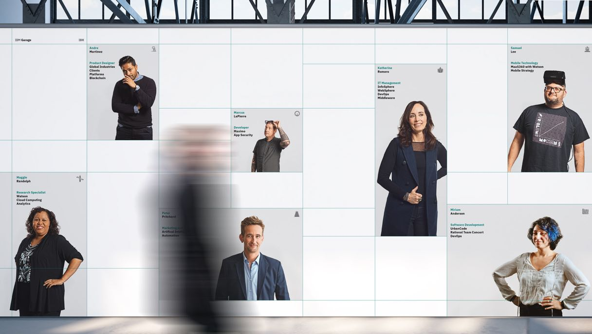
  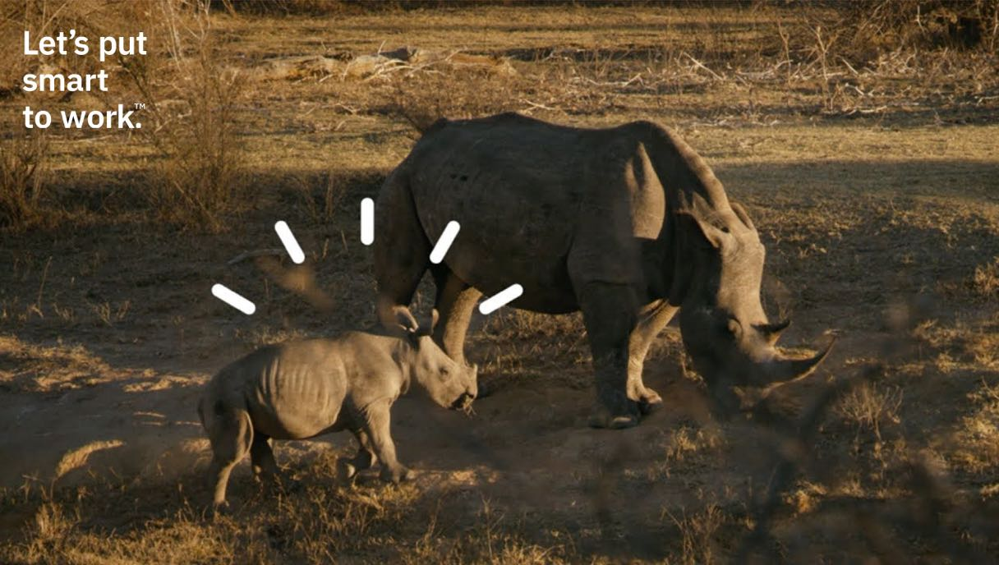
  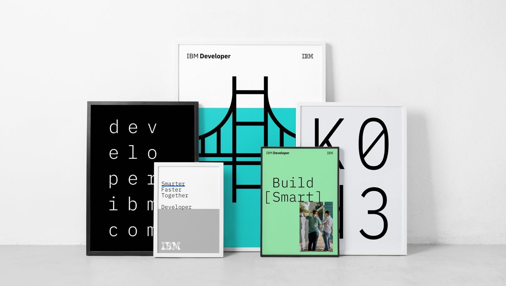
</carousel>

</column>
<column lg="3" md="3" sm="0">

> _It’s been exhilarating to help usher in a new design language and ethos for IBM. With this foundation, we’re building stronger bridges and elevating our design practices internally while also creating more unified brand experiences in the world—bringing that distinct ‘IBMness’ to everything we do._

> _***Sadek Bazaraa***   Design Director, Brand Experience_

</column>
</grid>
<grid background="gray-100">
<column lg="16">

</column>
<column lg="4">

### Services

</column>
<column lg="8" md="5">

## Are you a creative critical thinker with a strong passion for business?

Work directly with clients while partnering with IBM consultants and business strategists to drive outcomes that create both market impact and user impact.

Types of roles: graphic design, content design, business strategy, user and market research, consulting

<a href="https://www.ibm.com/services/careers" target="_blank">Open roles <icon color="blue" name="ArrowUpRight20" inline="true"></icon></a>
 

</column>
<column lg="8" offset_lg="4" md="5">

<carousel id="c3" count="1 2 3 4">
  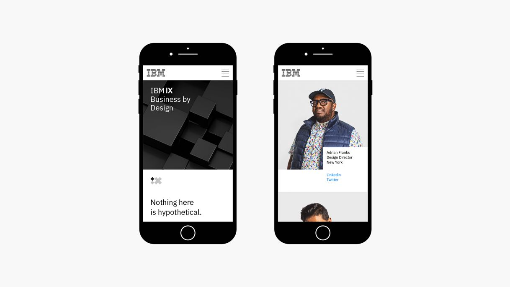
  
  
  
</carousel>

</column>
<column lg="3" md="3" sm="0">

> _To me, the biggest design challenge in the world right now is innovation. How do we continue to drive new ideas that will benefit peoples' lives without replicating an existing product just for the sake of it? Putting our users' needs at the forefront of every design challenge helps us ensure that we're always delivering what is right for them._

> _***Milly Longbottom***   Visual Designer, IBM iX_

</column>
</grid>
